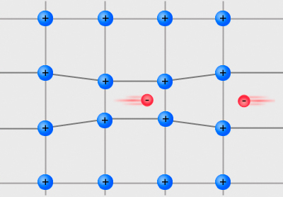

+++
title = "Cooper Pairs and Condensed Matter Physics"
date = 1957-07-22
link = "https://wikipedia.org/wiki/Cooper_pair"
icon = "fa-brands fa-wikipedia-w"
author = "Leon Cooper"
categories = ["Project Showcases"]
tags = ["Condensed Matter Physics", "Superconductivity", "Quantum Mechanics"]
image = "Cooper_pairs.jpg"
+++

This project explores the role of Cooper pairs in condensed matter physics, specifically in the study of superconductors.

<!--more-->

The work sheds light on how these electron pairs are key to understanding quantum effects in low-temperature systems.

