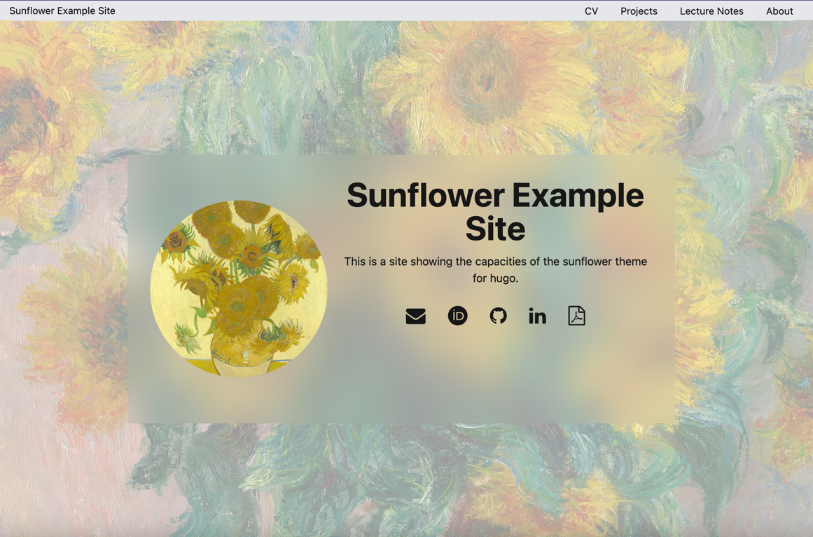

+++
title = "sunflower"
date = 2024-04-07
link = "https://github.com/Ruberhauptmann/sunflower"
author = "Tjark Sievers"
categories = ["Project Showcases"]
tags = ["Hugo", "TailwindCSS", "DaisyUI"]
image = "screenshot.png"
+++

A clean Hugo theme with yellows and greens using TailwindCSS and DaisyUI components.

