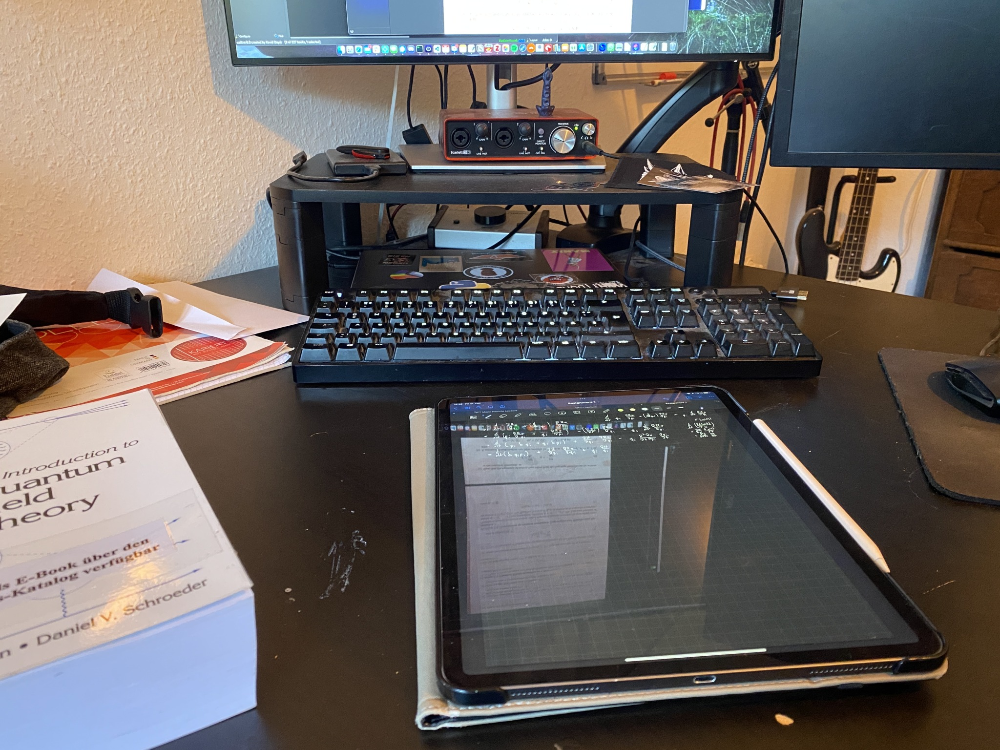

+++
title = "Week 1 // 17.10. - 21.10."
date = 2022-10-21
author = "Tjark Sievers"
categories = ["Blog"]
series = "Study Blog"
summary = ""
+++

Got back into things pretty well, I would say. This is my first (proper) semester in graduate studies, so there are some changes I need to get used to: smaller lectures, English as the main course language (which is not my mother tongue), way more independent choice of courses, just to name a few. I'm very happy to see my friend group from my undergraduate studies again and suffer through exercise sheets with them.

The top pictures shows the first steps of my note taking process: on the left are the notes I take in class (which are basically just there to keep my mind occupied, so I can actually pay attention) and then on the right are the notes I transcribe after, those build the foundation for my studying, so I annotate there, add stuff from books etc., so that I have a comprehensive overview of the course at the end. I'm trying to use more colours this semester to differentiate equations and text, just so I can skim my notes better. Will see how that works out!

Next week all the exercise classes are starting, so I also need to present/hand in the first exercises, but for now I'm pretty good prepared for that, just need to finish some smaller ones tomorrow and clean them up a bit.