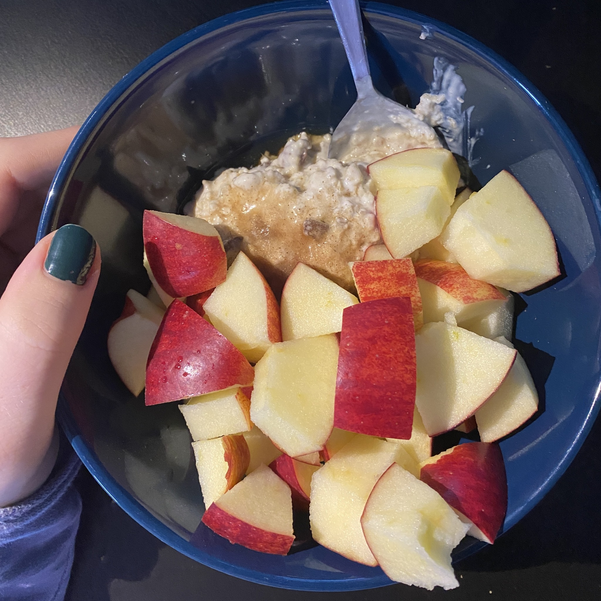
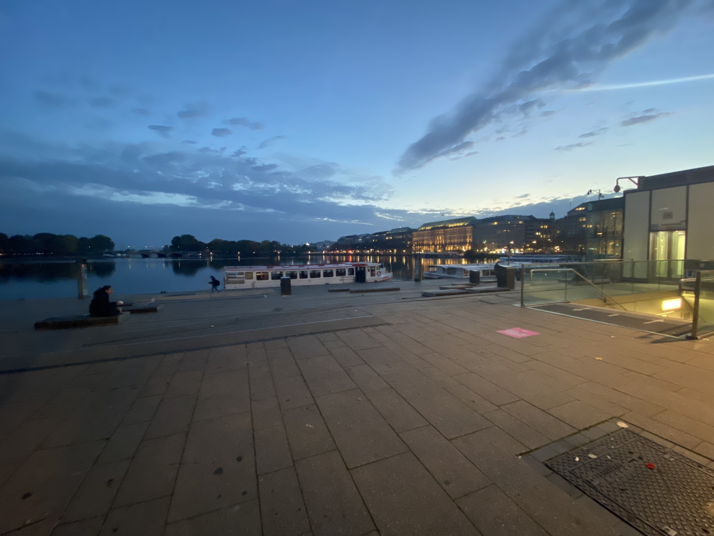
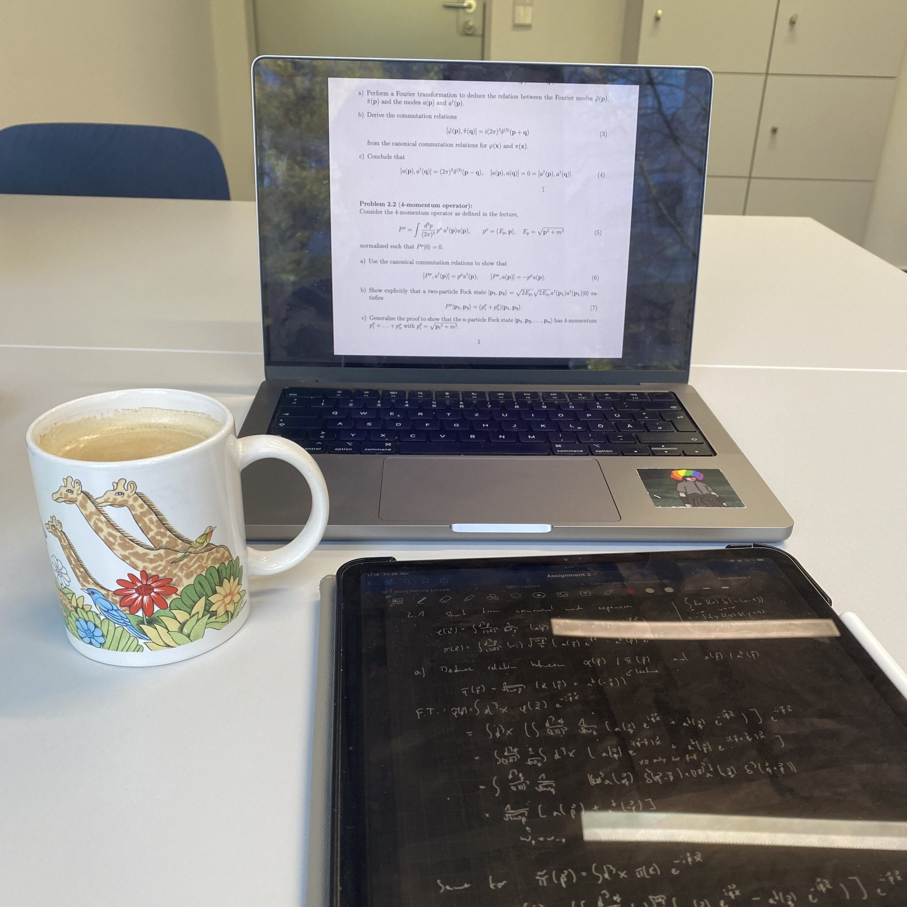

+++
title = "Week 2 // 24.10. - 28.10."
date = 2022-10-28
author = "Tjark Sievers"
categories = ["Blog"]
series = "Study Blog"
summary = ""
+++

Second week was a bit more chaotic than the last one, but I'm slowly finding a rhythm that works well for this semester. I have to do quite a bit of work this weekend, because I had some other stuff going on on Thursday and Friday, but it was wholly worth it!

Next week the term projects for the computational physics will be distributed. That is definitely the course I expect to get the most practical experience out of, so I'm looking forward to getting an interesting project to work on during the semester. I also just have one assignment due to the week after next week, so it's gonna be really chill compared to last week and I can focus on getting all the content from the lectures as they are slowly ramping up.

