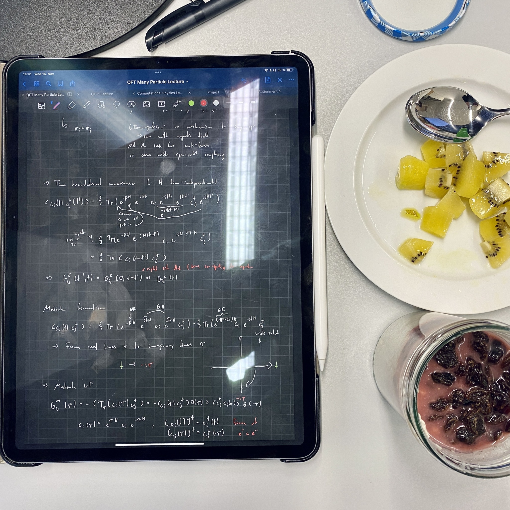
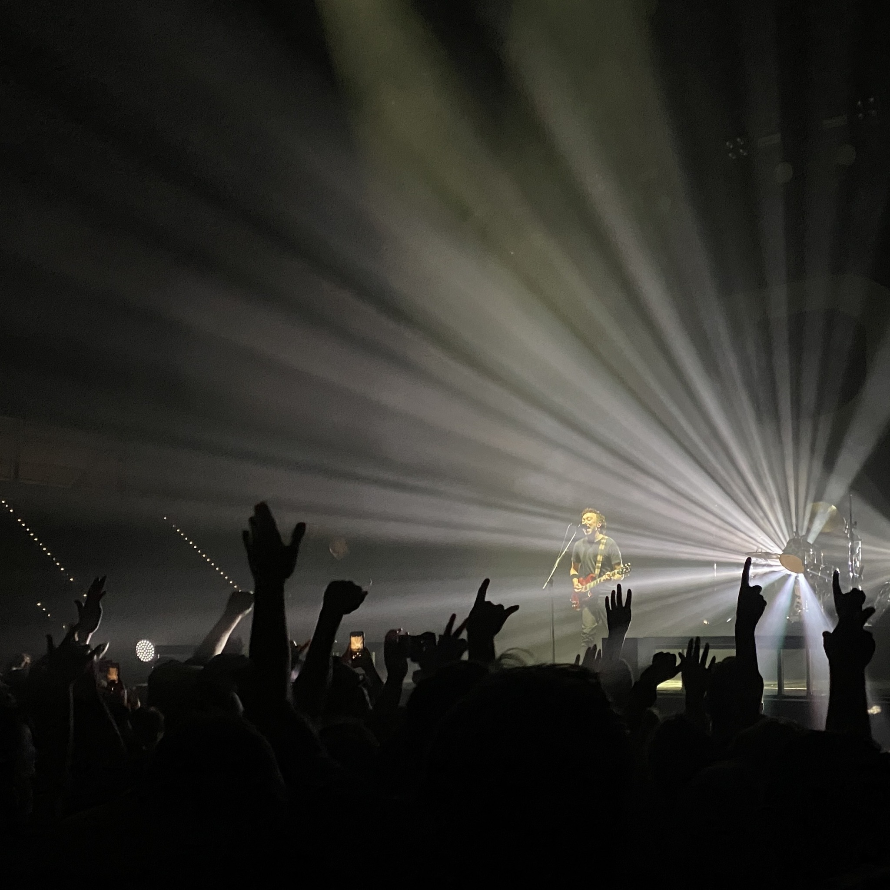
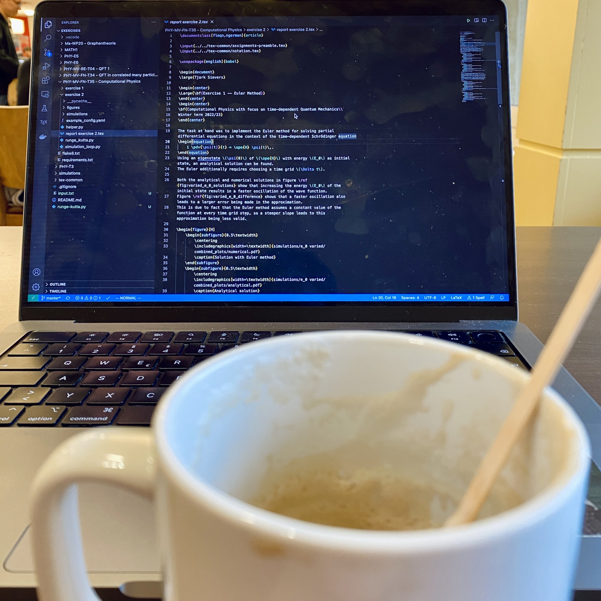

+++
title = "Week 5 // 14.11. - 18.11."
date = 2022-11-18
author = "Tjark Sievers"
categories = ["Blog"]
series = "Study Blog"
summary = ""
+++

Looking back, I did a lot of coding this week, which me very happy. Im making good progress on the project for the computational physics class (will go into more detail into what exactly I'm doing once I have some results to show). This also means I neglected my other classes a bit, so I need to work on that today for a bit, especially the Quantum Field Theory exercise sheet, did not start anything on there yet.

Thursday was kind of a rough day for me, just did not feel well emotionally then. What sometimes acutely helps me is throwing myself into some complex physics or coding problem and keeping myself occupied for a while. Still was pretty exhausted at the end of the day, but sometimes there are just days like this.

I saw Rise Against live last weekend, which was such an amazing experience!

