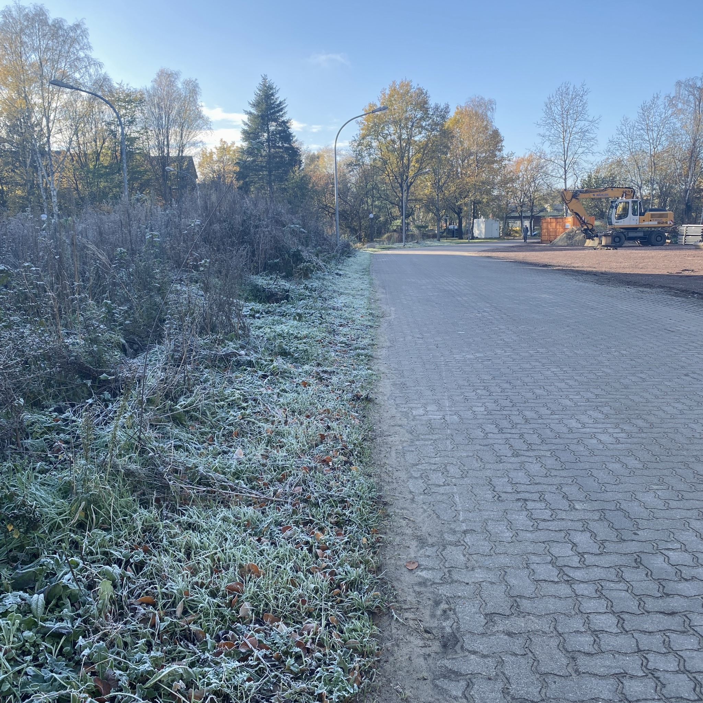
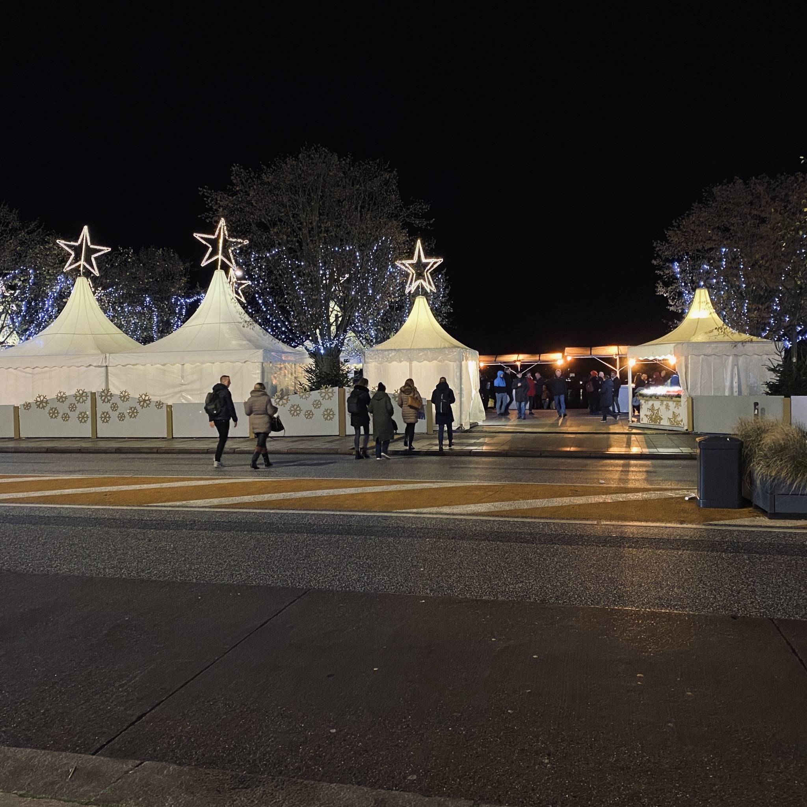
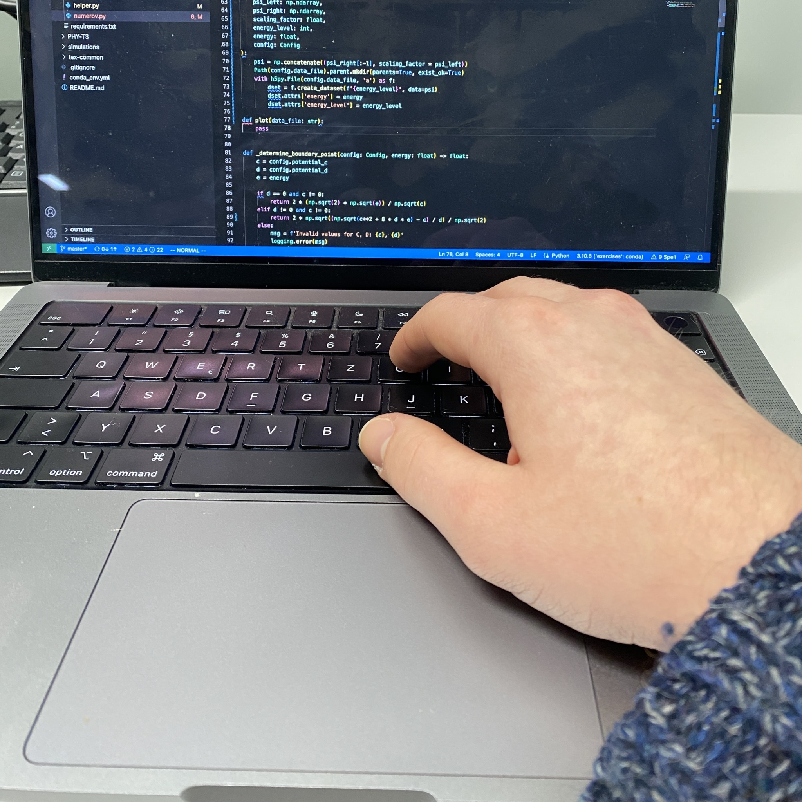

+++
title = "Week 6 // 21.11. - 25.11."
date = 2022-11-25
author = "Tjark Sievers"
categories = ["Blog"]
series = "Study Blog"
summary = ""
+++

It's suddenly getting very cold here, so im packing myself into layers of warm clothes. This also means Christmas markets are opening, so I already strolled a bit, getting into the mood. All the lights are really a great part of winter here!

The two lectures about Quantum Field Theory (one in the context of high energy physics, one in the context of condensed matter physics) have so many similarities in terms of what the strategies are dealing with interactions in the respective theories.

By this point in the semester, the first few topics are already done, so I feel a bit overwhelmed looking back at my kind of foggy memory of what we have done. I made a note to go over the first half of the semester and make a study plan for all the topics we covered and the exercises I still need to work on/correct. This will hopefully give me peace of mind and also be the foundation for me studying for the exam later.

