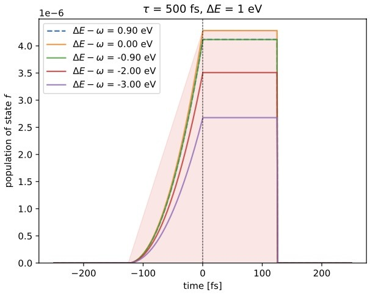
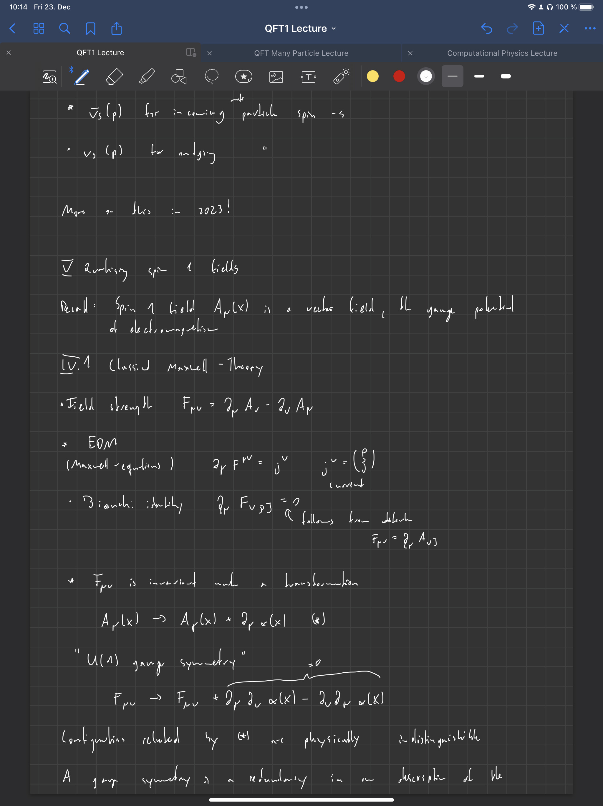

+++
title = "Week 10 // 19.12. - 23.12."
date = 2022-12-23
author = "Tjark Sievers"
categories = ["Blog"]
series = "Study Blog"
summary = ""
+++

This week I once again worked a lot on the Computational Physics exercises. I made good progress on them, now I have to do debugging on some of them, but I will definitely finish all the outstanding exercises over Christmas break.

Another goal for the Christmas break is to get on with the parts of Quantum Field Theory I didnt get yet (it’s mostly the part dealing with perturbation theory and the basics of Spin 1/2 fields), as that will probably be the important for getting the rest of the lecture (as well as being important for the exam).

