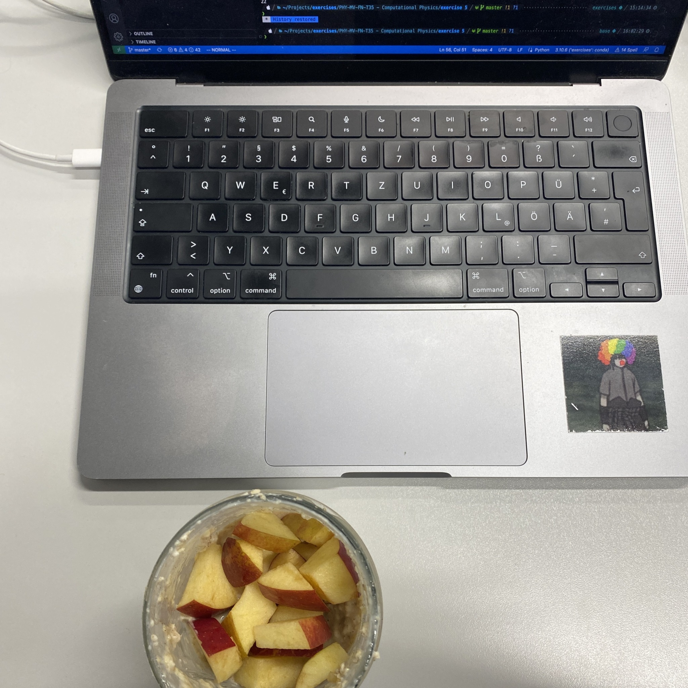
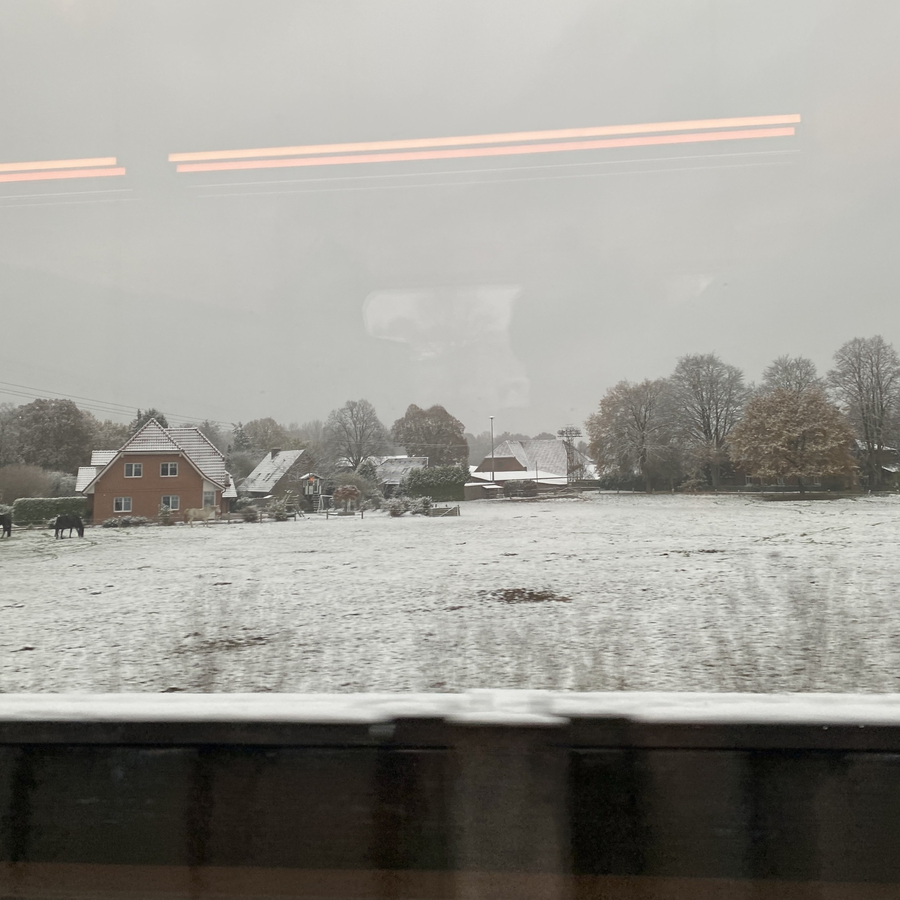
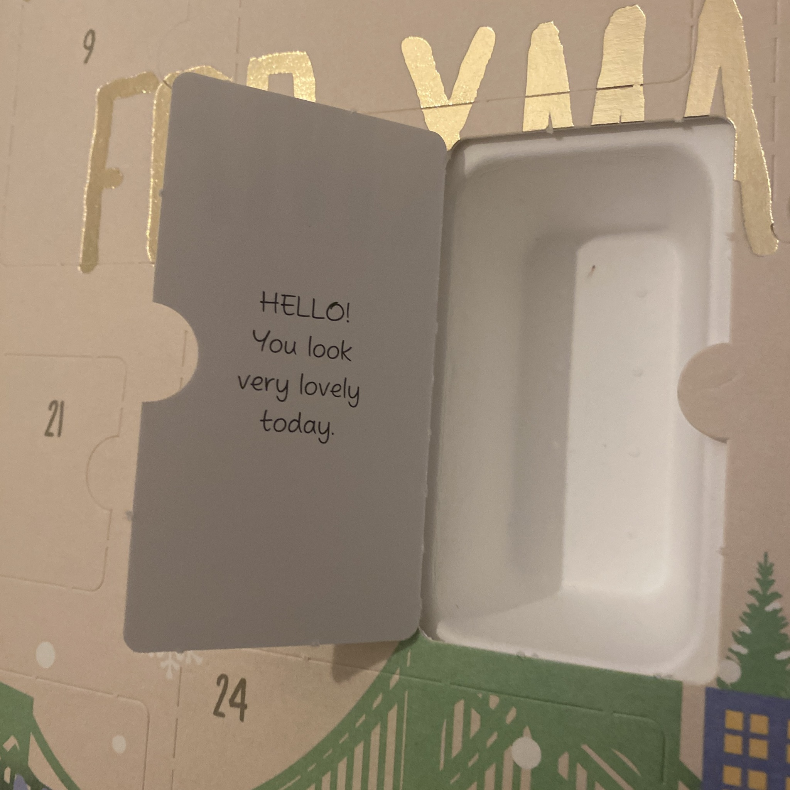

+++
title = "Week 7 // 28.11. - 2.12."
date = 2022-12-02
author = "Tjark Sievers"
categories = ["Blog"]
series = "Study Blog"
summary = ""
+++

It's getting very christmassy around here.
Discovered I will be starting my days with a cute slogan due to my advent calendar.

I am a bit behind on one exercise in my Computational Physics class, I have some weird bugs there and I just cant seem to get my program to converge to the right values.
At the moment I ignore that a bit and work on the next assignment, because the exercises will be collected at the end of the semester, so I can just work on the next ones for now and use the christmas holidays to work on that one a bit.

Additionally, (because it is now the second half of the term) I also need to hand in some exercises in Quantum Field Theory again, but I already did that for the first one, so I just have another one I need to do.

I'm going to put some time aside next week to make an overview of the topics from the first half of the semester to see where I'm lacking and what areas still need some connecting.

