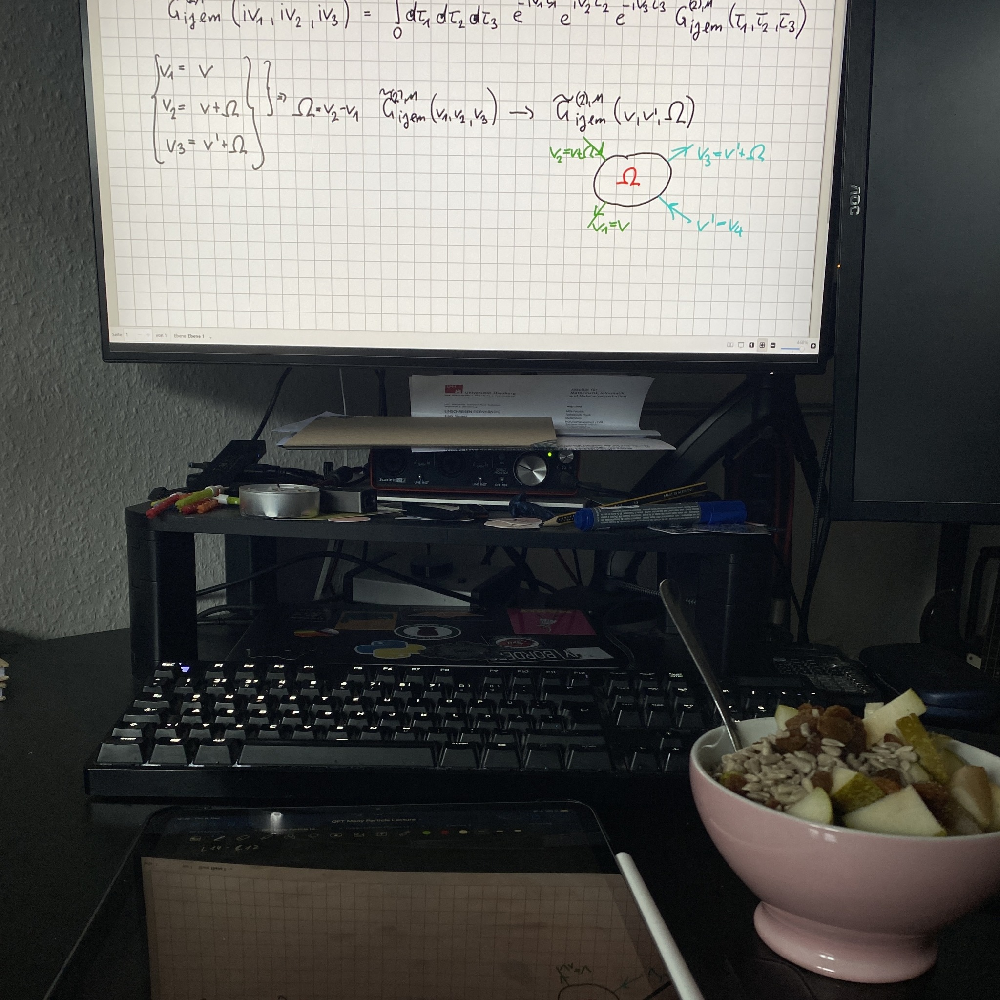
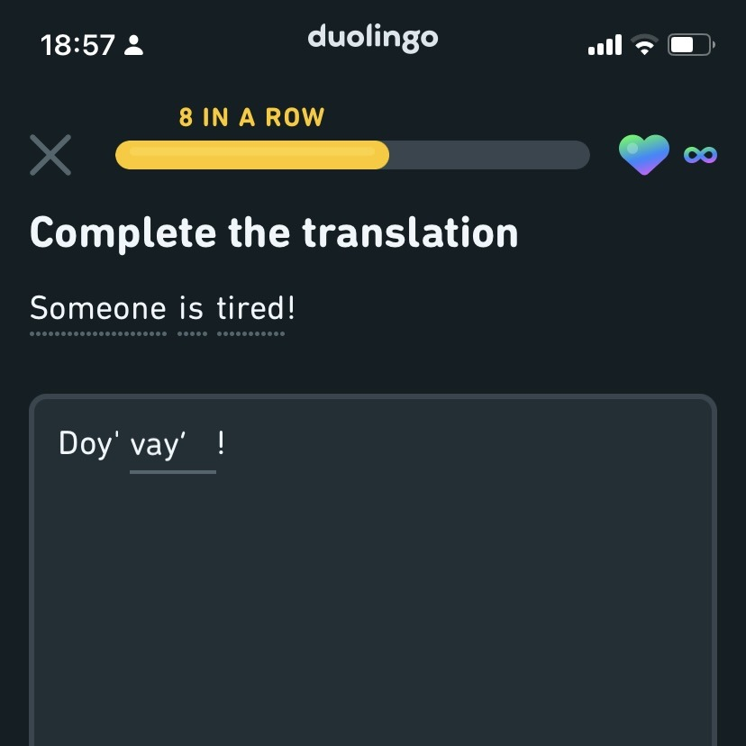
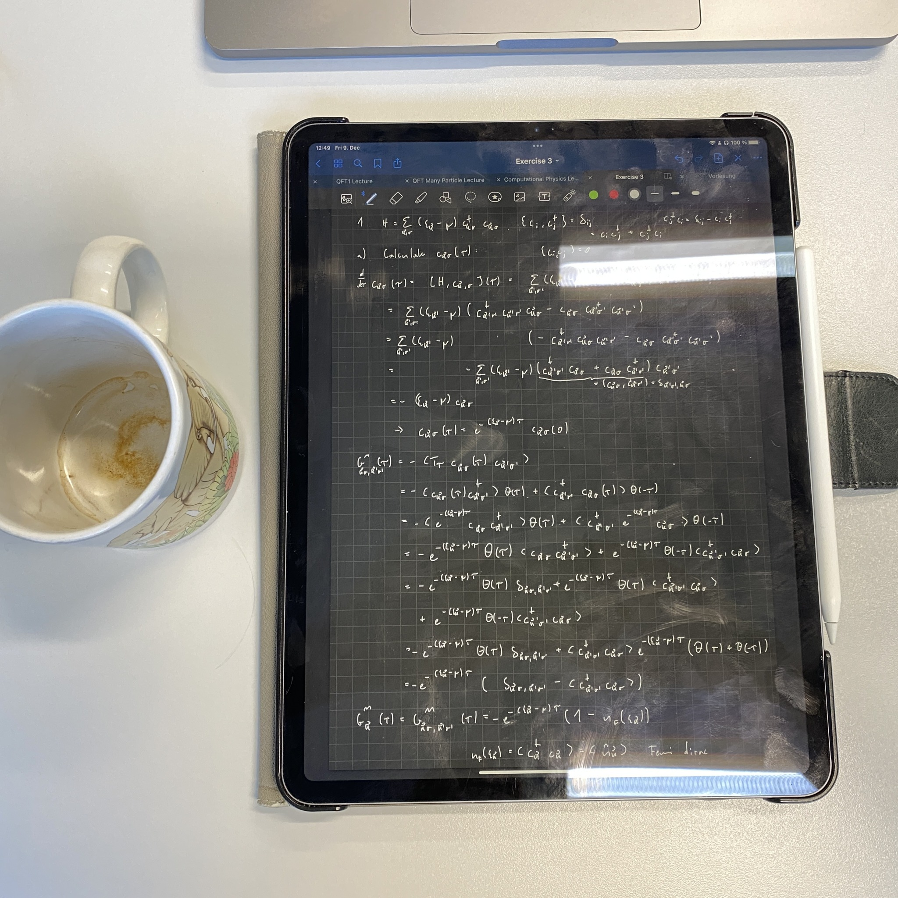
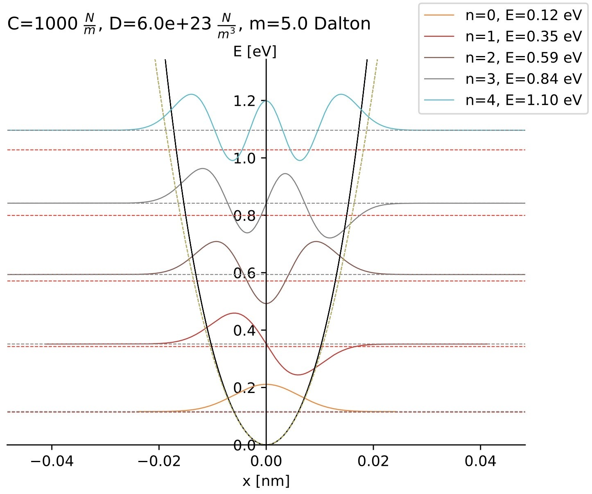

+++
title = "Week 8 // 5.12. - 9.12."
date = 2022-12-09
author = "Tjark Sievers"
categories = ["Blog"]
series = "Study Blog"
summary = ""
+++

I'm noticing how much I am in need of a break in the semester, to catch up on some assignments and content as well as just having some time for time where I don't need to get up super early every day. So very happy that I only have two weeks left until winter break.

This week got very stressful in the end, with the next exercise sheet for QFT in correlated many-particle systems which got uploaded Thursday and is due Wednesday next week. I already started some tasks, and it's mostly straight-forward calculations of simple cases for Green's functions, so I'm optimistic to get through it quite well. I'm away for the weekend, so I just have Monday evening and Tuesday to finish that, that is already putting me under a lot of stress right now.

I finally finished one of the Computational physics exercises from earlier (the plot in the last picture) and submitted that! It feels good to make a dent in the workload there, even though there is a new tasks coming every week. Having a lot of middle-of-the-semester emotions right now, trying to be kind with myself in the next weeks.

