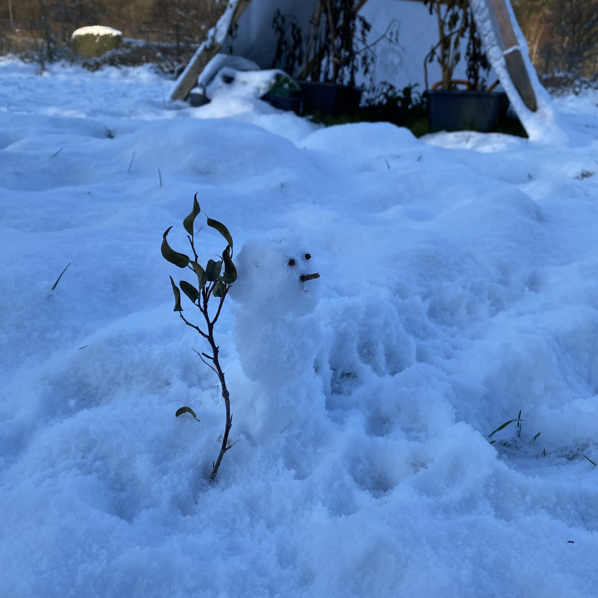
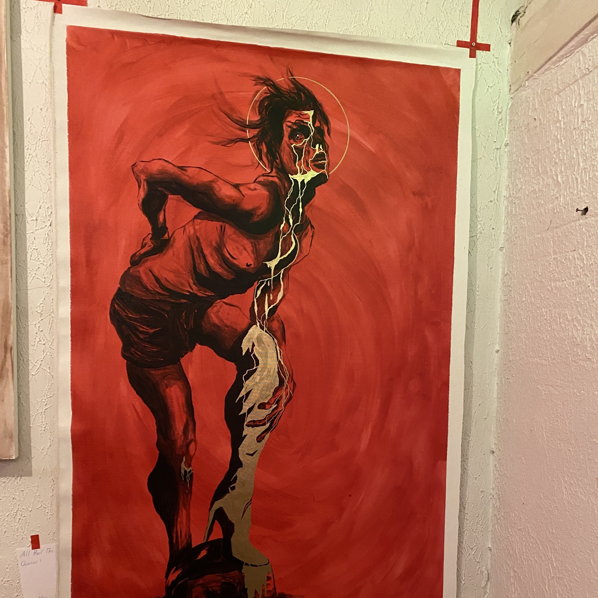
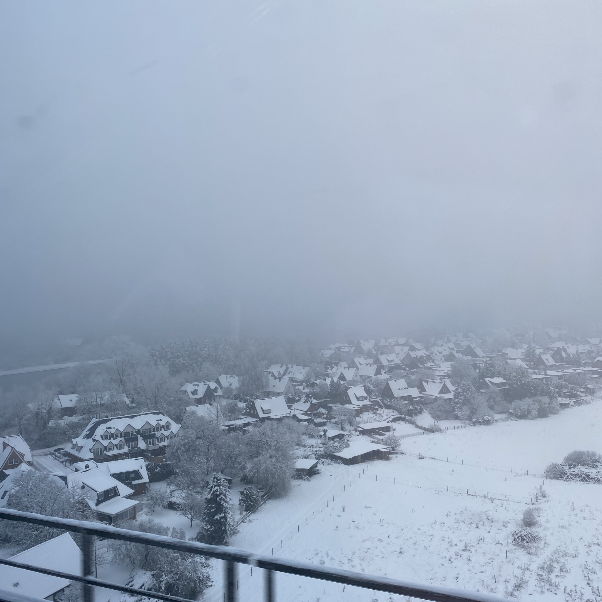
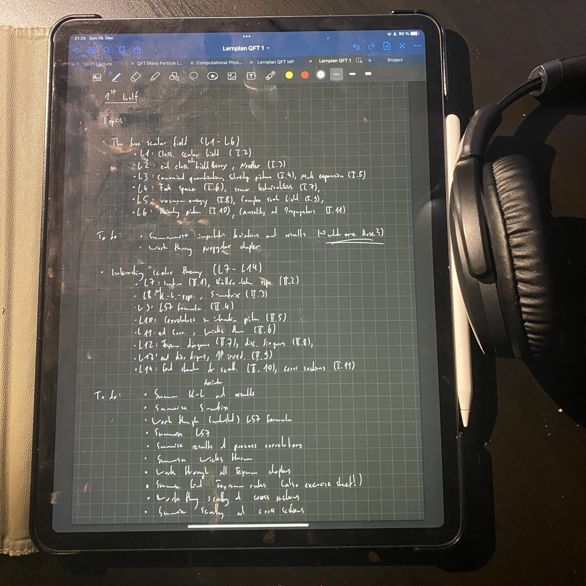

+++
title = "Week 9 // 12.12. - 16.12."
date = 2022-12-16
author = "Tjark Sievers"
categories = ["Blog"]
series = "Study Blog"
summary = ""
+++

This week I wasn't really at uni much. Monday I was still away for a trip with some friends visiting the childhood home of one of them, mostly for seeing the Christmas market there, Thursday I was at a concert and drove over visiting some other friends on Friday. Additionally one of my professors had covid, tested negative on a rapid test, still had symptoms and decided that was enough to go to uni, so I decided to just skip that lecture to avoid getting infected that way right before Christmas.

So instead of study pictures there is a little snow person I built, some art I looked at at the exhibition one of my friends is helping organising and the pretty snowy villages I got to look at from my train.

I made overviews of the first half of the semester for the two lectures I have exams coming up to get a realistic overview of what I still need to do. For the condensed matter lecture, this was quite nice as I noticed I don't really to study that much. For the Quantum Field Theory lecture, this was a bit more discouraging, as there is quite a lot of content to cover and I have so much to catch up on. Still, it is good to have the overview now and see what I need to do in preparation for the exam.

