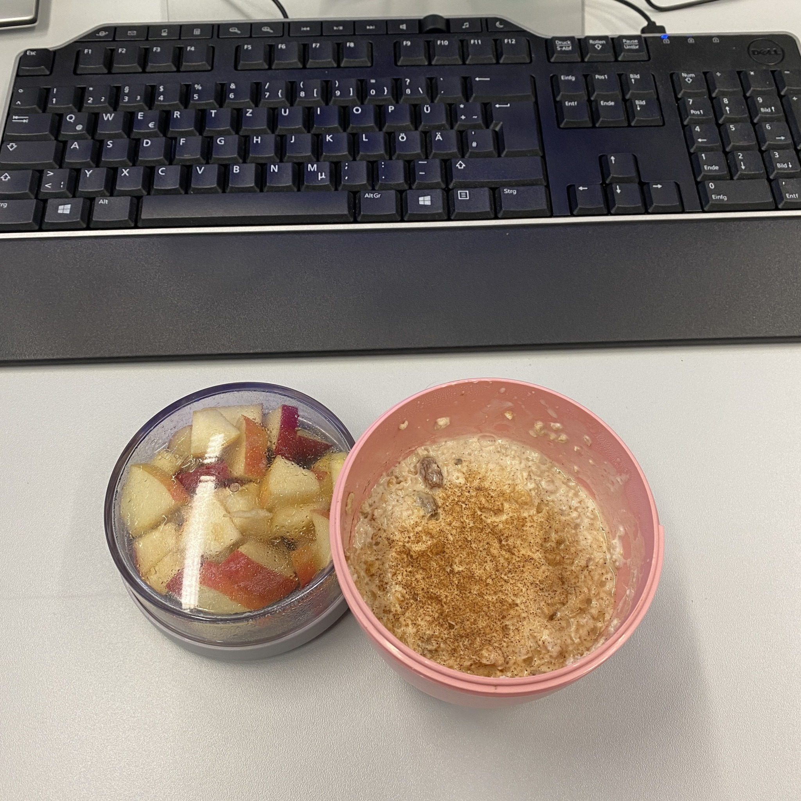
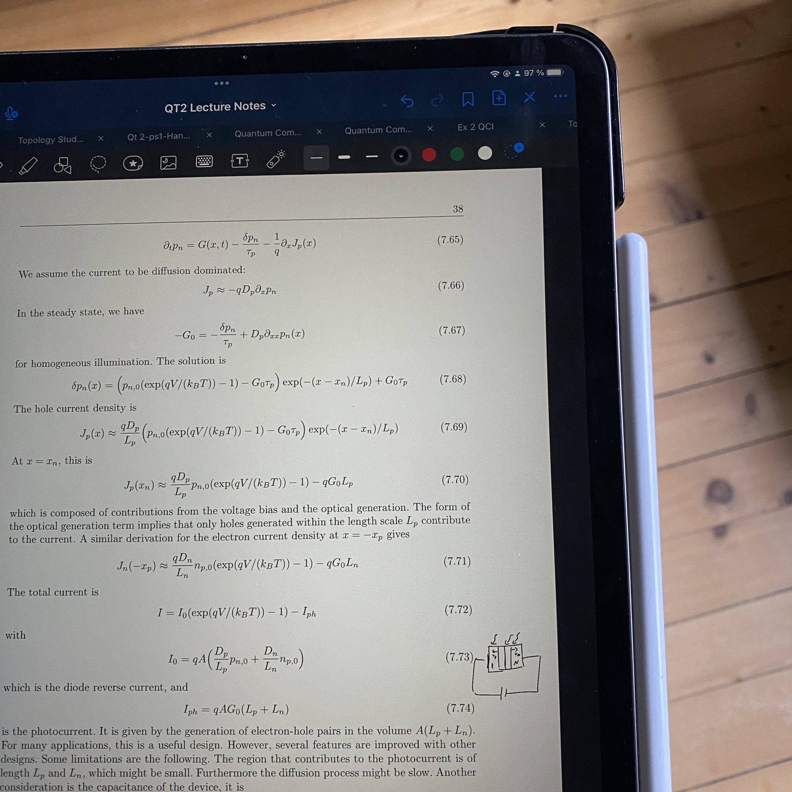

+++
title = "Week 4 // 24.04. - 28.04."
date = 2023-04-28
author = "Tjark Sievers"
categories = ["Blog"]
series = "Study Blog"
summary = ""
+++

This week I really noticed how much more chill my week is compared to last semester. I didn't sleep that well most nights, so wasn't as motivated most days, and still stayed on top of almost all lectures and exercise sheets. Much of that is just learning from last semester how much time I really have and what helps me most studying for things and what is just unnecessary work. Once I have my workflow figured out for all lectures, I'm gonna share my process in more detail.

I'm gonna enjoy my long weekend (Workers day!) at my parents place, working through some lectures that are on my pile and do some programming for the Quantum Technologies lecture (something about transport in semiconductor).

