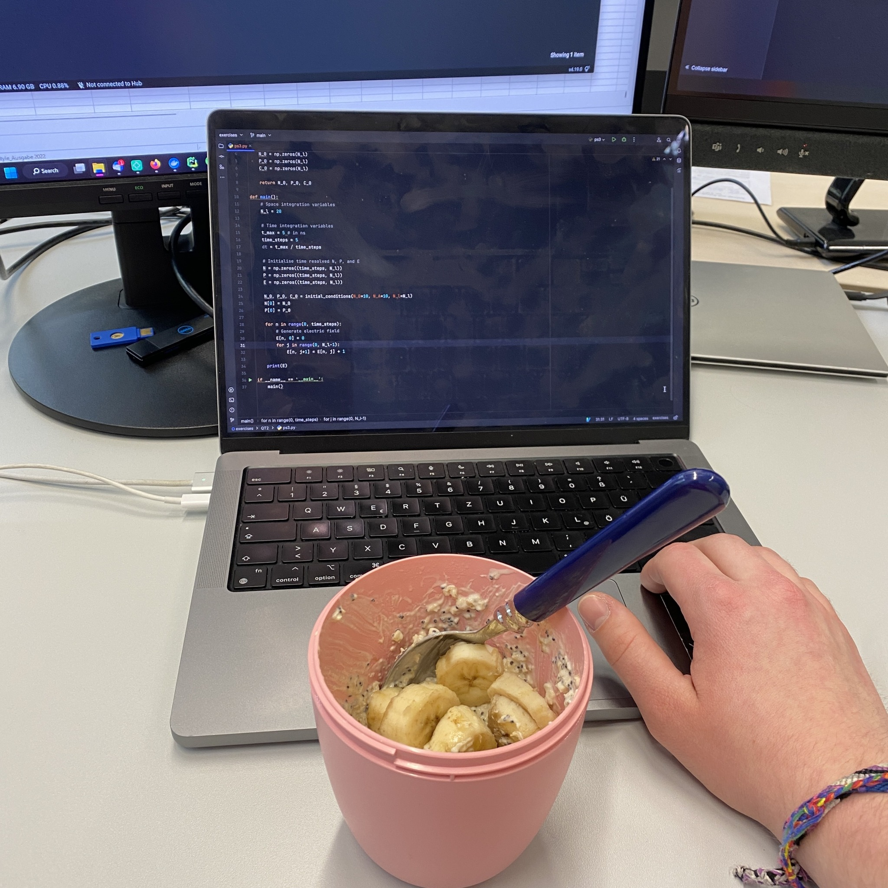
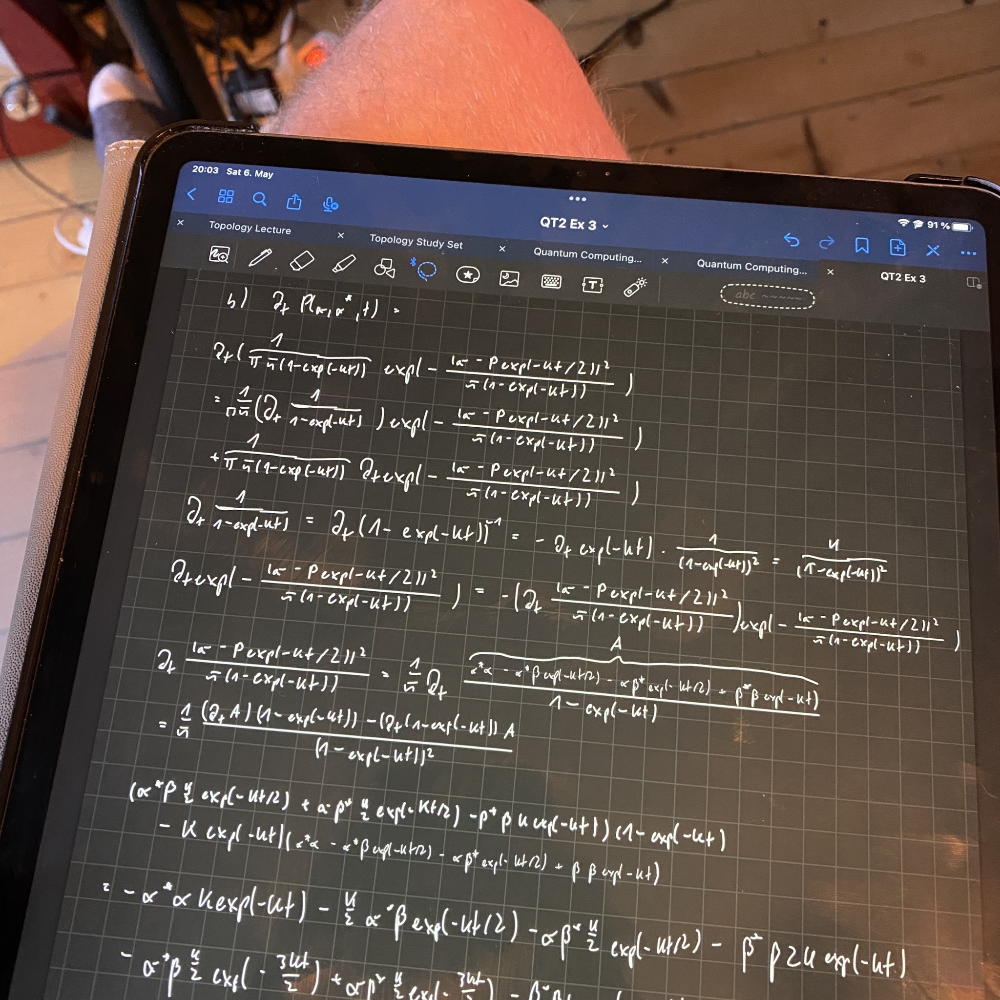

+++
title = "Week 5 // 1.05. - 5.05."
date = 2023-05-05
author = "Tjark Sievers"
categories = ["Blog"]
series = "Study Blog"
summary = ""
+++

I slacked a bit on an assignment I have for next Monday, so a bit of last minute work needed to go into that sadly. Otherwise I'm pretty up to date working on the Quantum Computing lecture, as well as on the Topology lecture (which is pretty exciting, last semester I was full on packed with just the exercises and couldn't even work on lecture revision).

Next week is another normal week of lectures, after that we have a week of vacation, so I'm gonna try to get all of the time sensitive stuff done next week, so I can have the free week as free as possible. 

