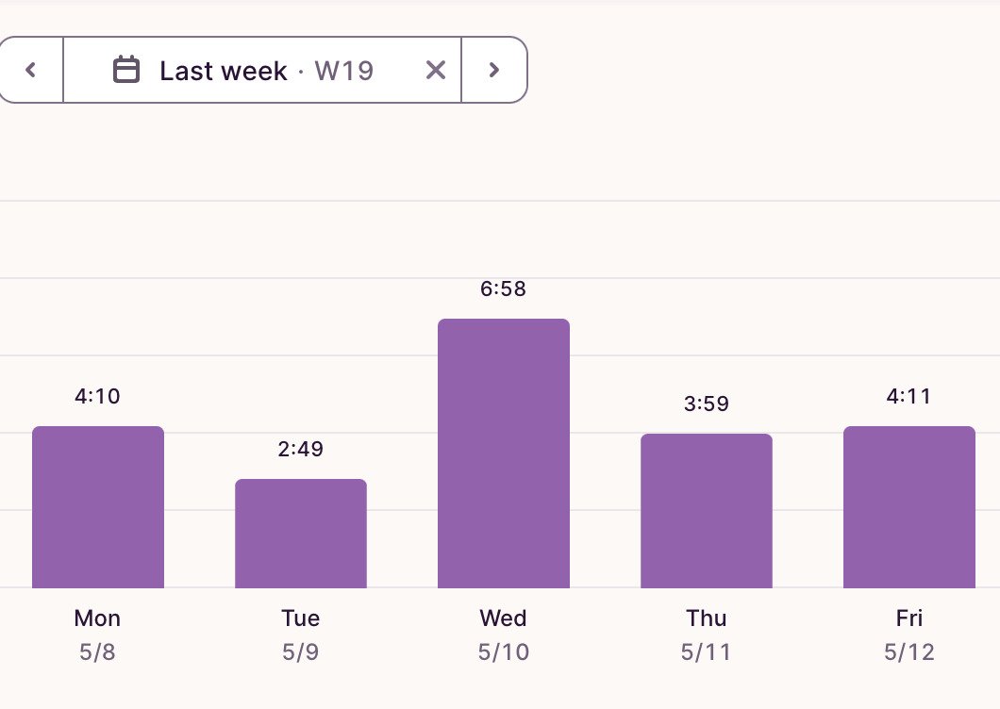

+++
title = "Week 6 // 8.05. - 12.05."
date = 2023-05-12
author = "Tjark Sievers"
categories = ["Blog"]
series = "Study Blog"
summary = ""
+++

Last week was a bit all over the place, just had little time frames to work on exercises and lectures, but that was quite fine, because the next week is a holiday week at our university, so I have a bit more time to finish all exercises then.

I missed my two quantum computer lectures, one because my bus was super late and the second one because there was a introductory tutorial about polarisation given by the last winner of the Hamburger prize for theoretical physics, Nicola Spaldin. That was absolutely amazing, she is such a good teacher! She also has a Youtube channel.

I'm pretty sure I can get through all exercises I need to do next week while also having quite some free time to enjoy the now starting good weather here.

