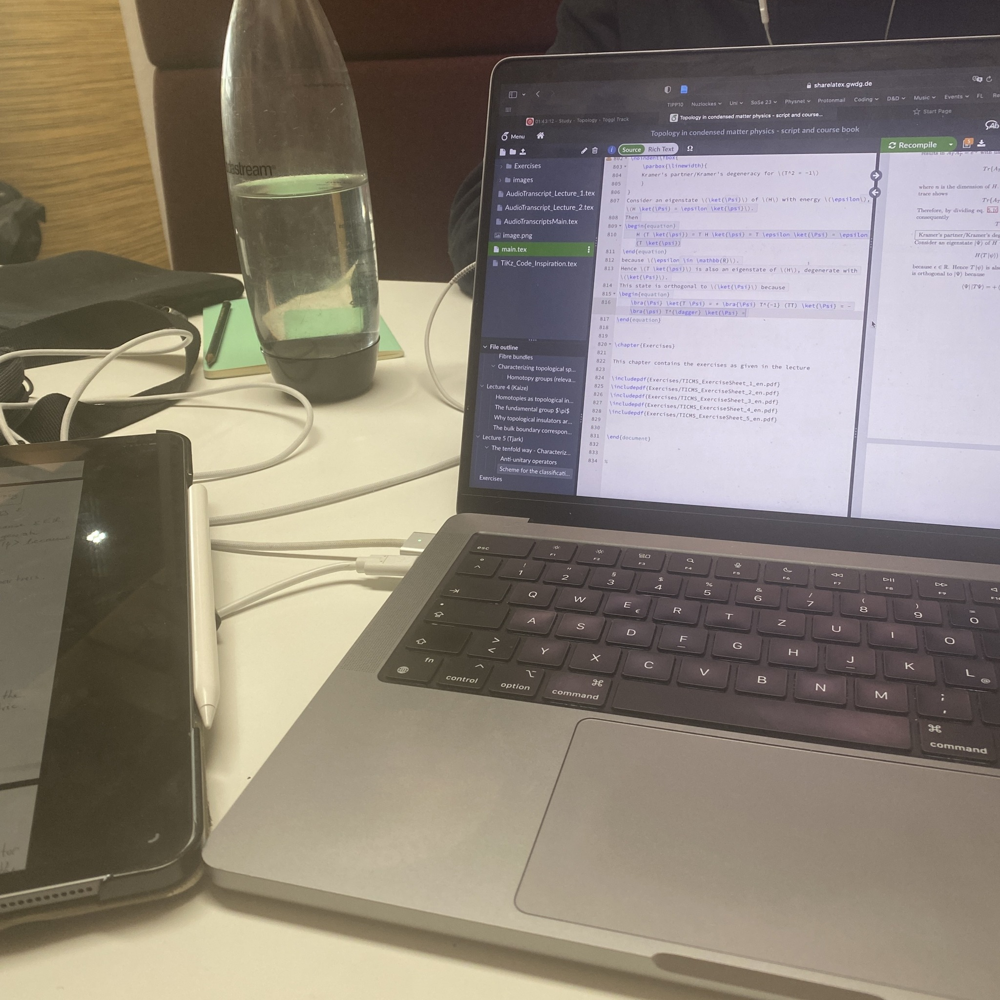

+++
title = "Week 7 // 15.05. - 19.05."
date = 2023-05-19
author = "Tjark Sievers"
categories = ["Blog"]
series = "Study Blog"
summary = ""
+++

I got a lot of stuff done last week, im surprisingly up to date on all of my lectures, and also got through the most important exercises for the week, which is pretty nice all around. But furthermore, I still got to spend a lot of time with my girlfriend, who visited me. We had a lot of study dates over the week, but were also able to do some fun stuff, and it makes me so happy that on the one hand the workload this semester is way more chill and on the other hand that I have way more self awareness about how I learn best and what I need to do to follow my lectures.

This week is quite normal, but we won't have exercise sheets due to next week Monday because it is a holiday here. That means I get to have some more time to enjoy the sun!

