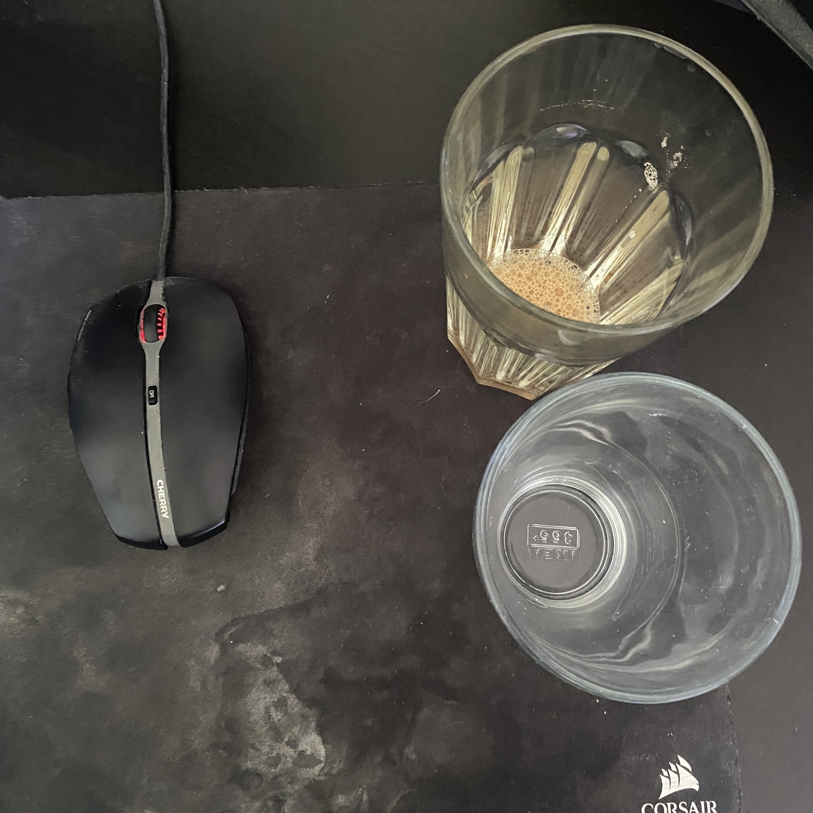
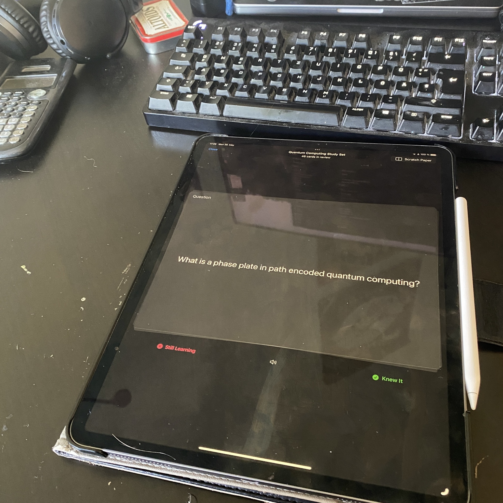

+++
title = "Week 8 // 22.05. - 26.05."
date = 2023-05-26
author = "Tjark Sievers"
categories = ["Blog"]
series = "Study Blog"
summary = ""
+++

This week I mostly did work on the exercises in Quantum Technologies outside of visiting my usual lectures. Except for that I didn't do a lot of work on lectures, so my backlog on lectures grew a bit. I need to start working on that, so that I have some study material already in place. I'm using Goodnotes study sets for the first time this semester, it's very nice to be able to directly create index cards from my notes.

In general I can follow the content of my lectures quite well this semester, its quite nice to not have one lecture overshadow everything in terms of work, so I can work on all lectures in about equal parts.

