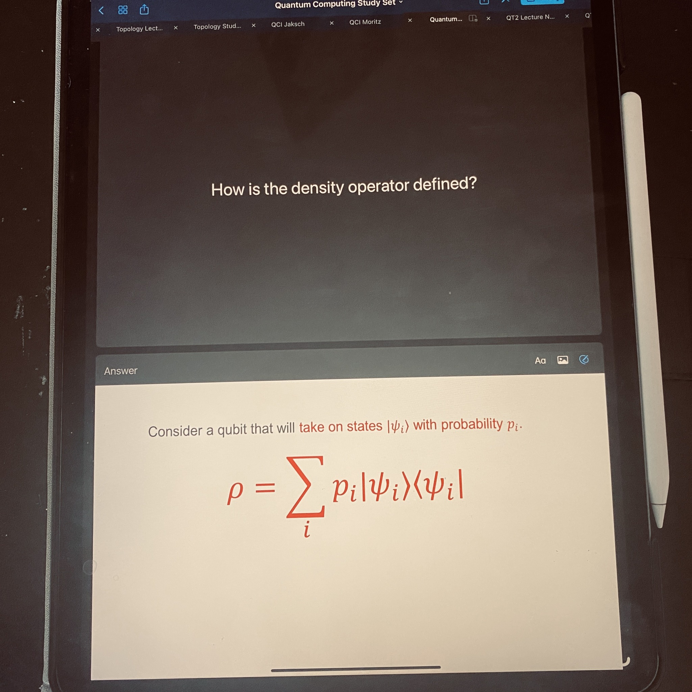
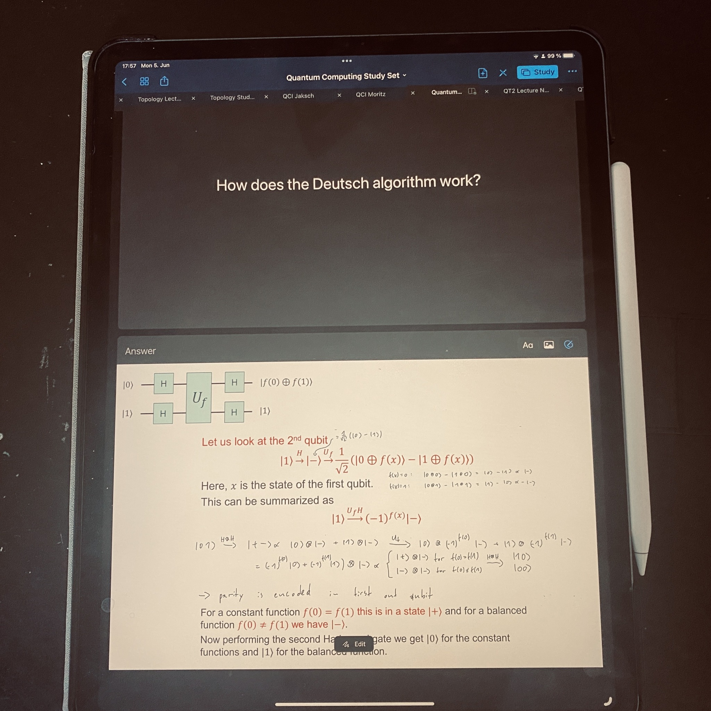

+++
title = "Week 9 // 29.05. - 02.06."
date = 2023-06-02
author = "Tjark Sievers"
categories = ["Blog"]
series = "Study Blog"
summary = ""
+++

This week wasn't that exceptional, I am kind of slacking in many aspects right now, but I can still follow most of the contents of my lectures. What I really need to get on with is preparing study sets for all my lectures. They are the foundation for my exam preparation and I'm quite behind right now.

As such I wanted to show a bit how I use Goodnotes study sets. For oral exams I need to be fit on definitions, concepts and also specific examples. For all of those things I can easily make index cards from the slides provided in combination with notes from me or from my handwritten notes where no slides are provided. This provides me with a solid foundation and also forces me to think about the concepts in my own words already, which is perfect for oral exams. This combined with speaking with other people and basically doing mock exams is my whole preparation for oral exams, and so far that worked really well.

