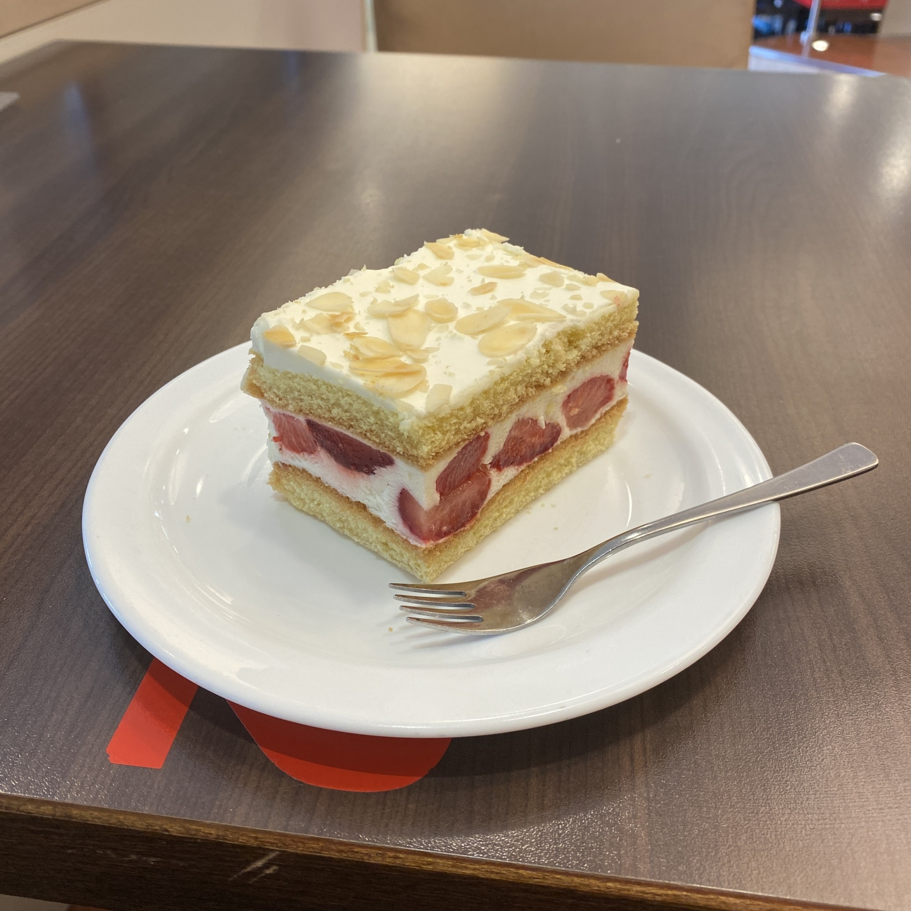

+++
title = "Week 13 // 26.06. - 30.06."
date = 2023-06-23
author = "Tjark Sievers"
categories = ["Blog"]
series = "Study Blog"
summary = ""
+++

A typical symptom of me getting really unhealthily stressed out about uni work are a lot of logged time entries in the evening, and mostly short ones. This means I don't try go get rest in the evenings, but always try to push myself further. And last week that was definitely the case. For next week I want to commit to using my evenings to rest, and use my days a bit better, just to get out of this mindset that I could always do more. (The cake is from our cafeteria, I'm slowly trying every cake they have there. For science!)

