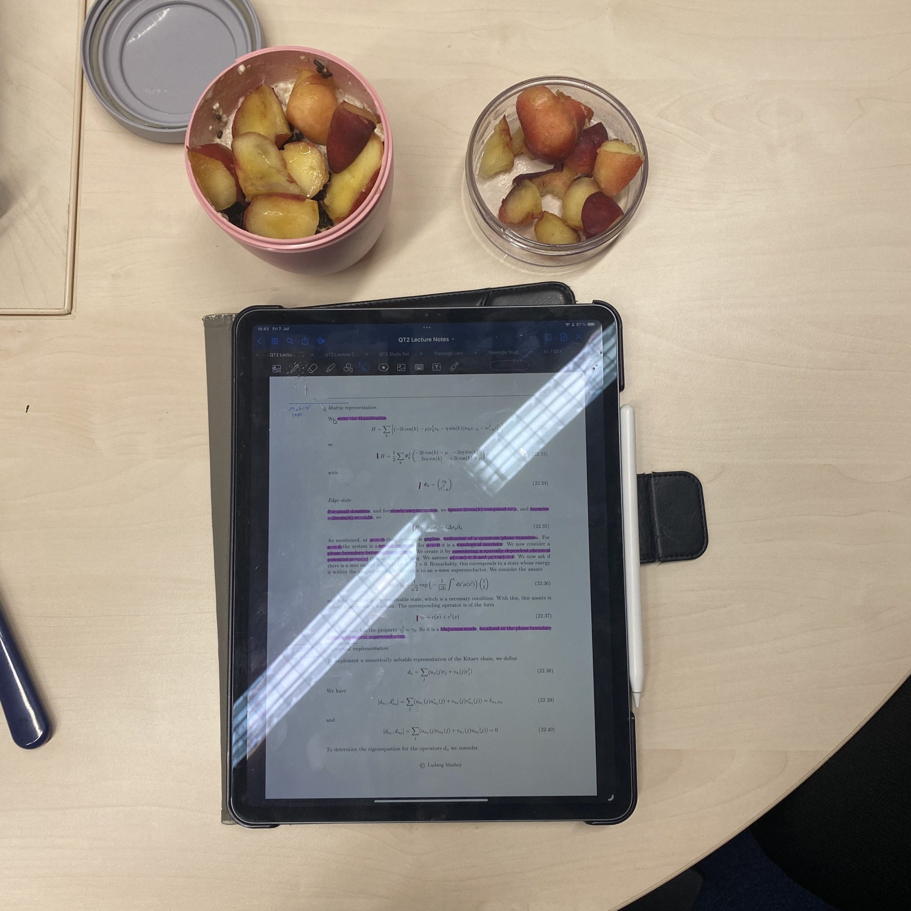
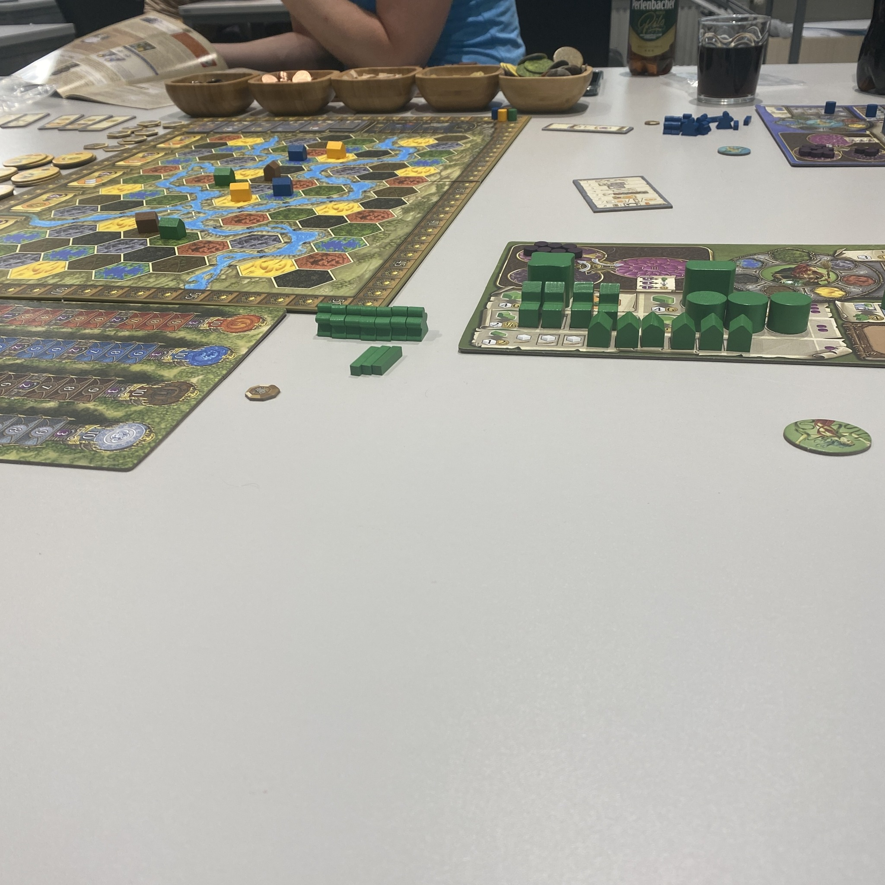

+++
title = "Week 14 // 03.07. - 07.07."
date = 2023-07-07
author = "Tjark Sievers"
categories = ["Blog"]
series = "Study Blog"
summary = ""
+++

This week I worked a lot, mostly on pushing forward my backlog of older lectures I didnt yet work through, in preparation for the upcoming exams. I did make some progress, but I also didnt quite prioritise resting as much as I wanted, so I worked quite a few evenings and it was a bit draining all in all.

But we finally got around to doing a board game night on Friday, that was a lot of fun!

Next week is the last week of the semester, so I'm fully switching into exam preparation mode then, putting everything on flash cards and talking through all the content at my whiteboard, that always helps me best prepare for oral exams.

