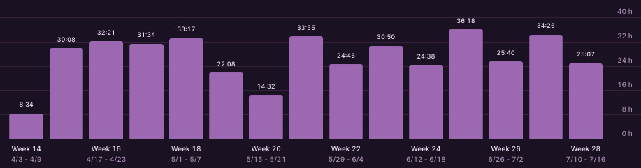
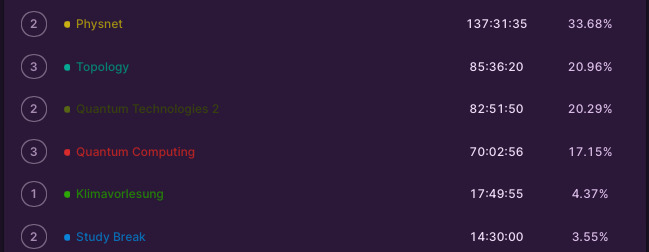
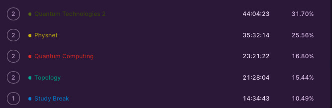
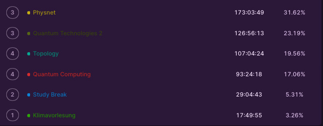

+++
title = "Time tracking review"
date = 2023-09-13
author = "Tjark Sievers"
categories = ["Blog"]
series = "Study Blog"
summary = ""
+++

It's now quite a lot after the end of the semester and all my exams, I thought I might do another review of how I spent my time studying this semester.

First of all, just the time in the semester:

So I worked about equally in all modules. Interestingly, the module where I spent the most time was one where we just had one lecture per week. So I noticed here that interest decides so much what I spend my time on, on a week-to-week basis, and that things will fill the time I give to them.

A lesson here could be that I maybe should keep in mind when I have things that dont necessarily fall into my immediate area of interest, that those can easily just scrape by, and that will definitely bite me later, when preparing for exams.

Next, the time I spent studying after the semester was over:

Here comes into play what said about letting things scrape by. The 23 hours studying for Quantum Computing just weren't enough to have me be confident, and I could have avoided that by being more diligent during the semester.

And finally, this is all the time I spent studying, in the semester and for the exams:

Notably, I did have one module that ate away all my time as last semester. I worked a whole 60 (!!!) hours less in my most intensive unit this semester than I did last semester.

All in all, the semester itself was more relaxed than the last one, and that was really good, and I think I learned something from time tracking last semester, just looking after not having one module take up all my time, prioritising my time better.
