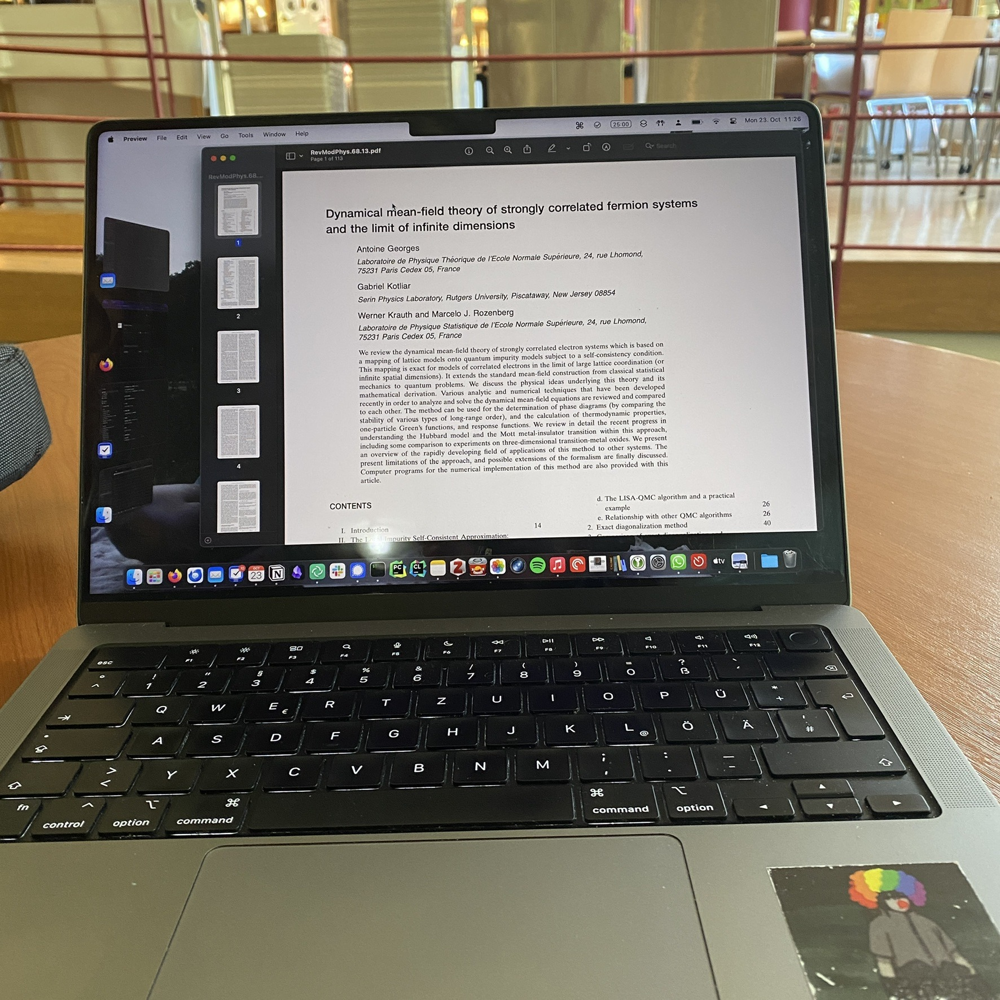

+++
title = "Week 1 // 16.10. - 20.10."
date = 2023-10-20
author = "Tjark Sievers"
categories = ["Blog"]
series = "Study Blog"
summary = ""
+++

This semester is the last one before my master thesis, and all I gotta do are some credits in elective courses. I chose a lecture about anthropogenic accidents and one about working with data.

I also have some presentations in group seminars, I thought this might be a good use of my time, just really getting into some specific topics and practicing my presentation skills a bit.

