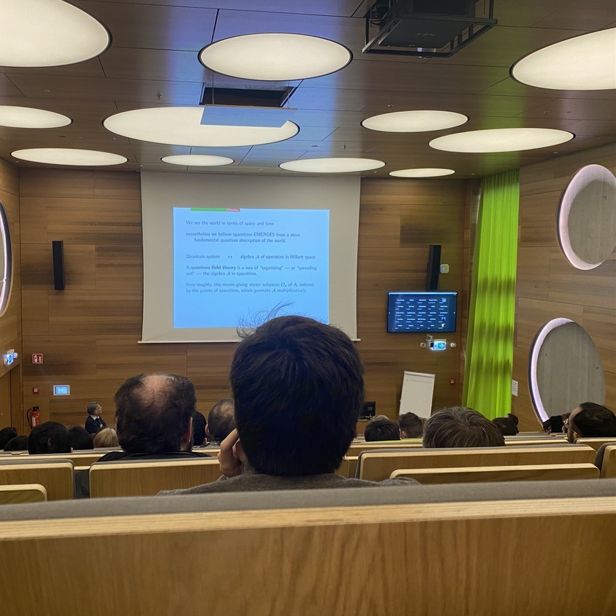
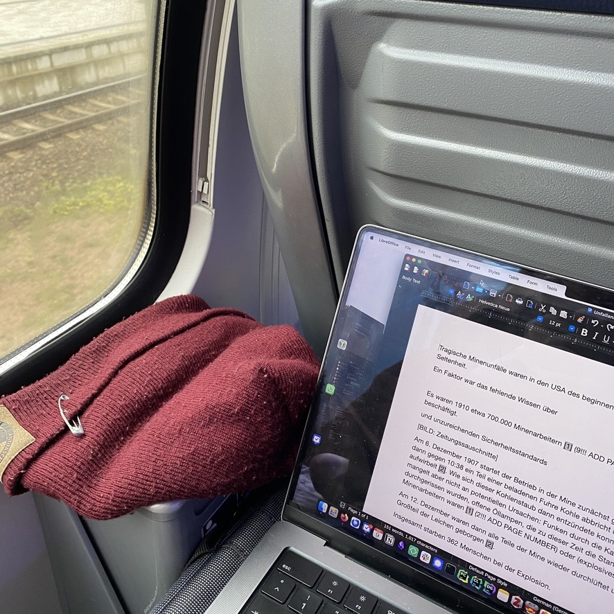

+++
title = "Week 4 // 06.11. - 10.11."
date = 2023-11-10
author = "Tjark Sievers"
categories = ["Blog"]
series = "Study Blog"
summary = ""
+++

This Wednesday I went to a symposium on occasion of the Hamburger Prize for theoretical physics, which was awarded to Edward Witten this year. The talks went way over my head for the most part, as they focused on string theory and mathematical physics in general. I also went to the award ceremony, which was a lot of fun! Also I noticed I probably need to get a suit, I was very lost on what to wear for it.

