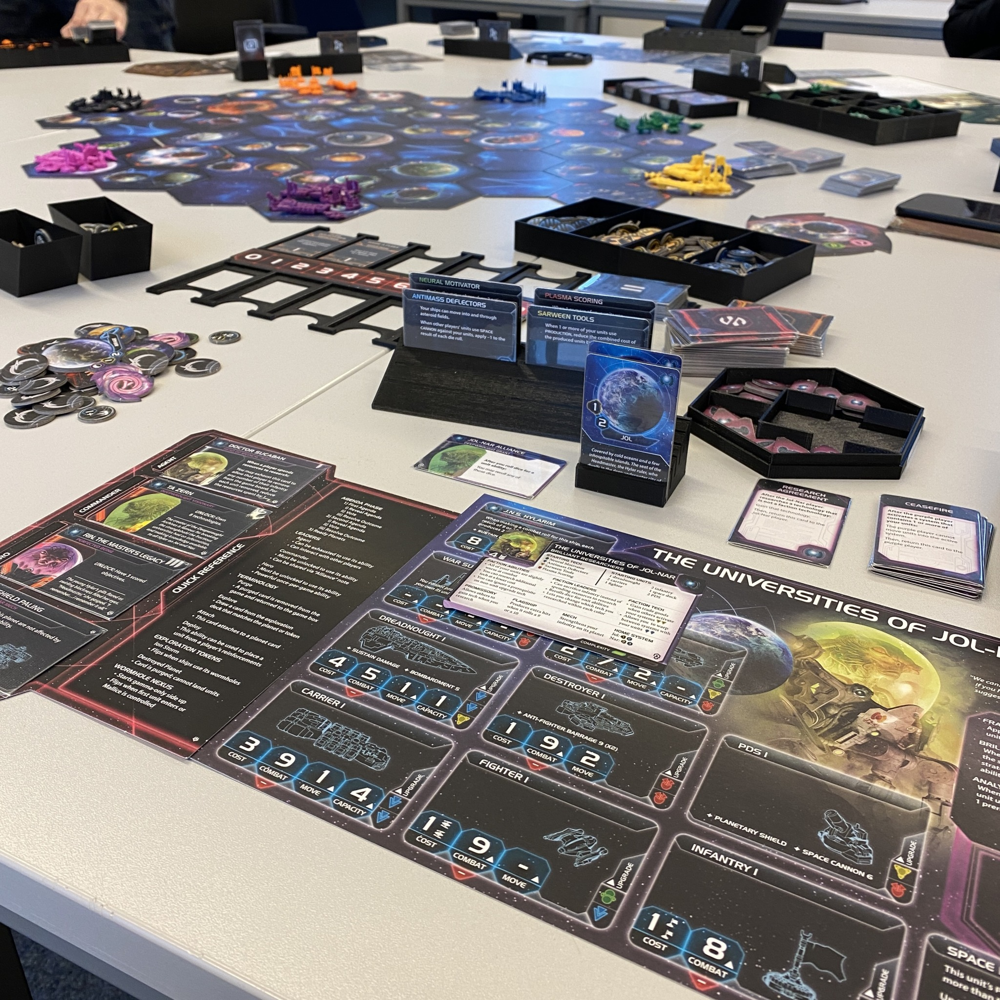
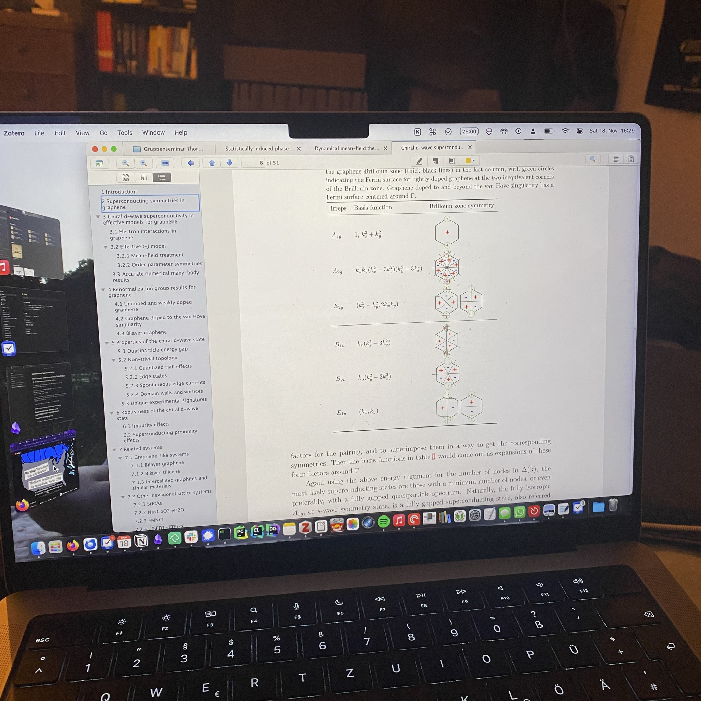

+++
title = "Week 5 // 13.11. - 17.11."
date = 2023-11-17
author = "Tjark Sievers"
categories = ["Blog"]
series = "Study Blog"
summary = ""
+++

Last Sunday I played a big board game. Like, a BIG one - 12 straight hours of Twilight Imperium 4 with the Prophecy of Kings expansion. It was a lot of fun, and I'm very down to playing again with the group some time.

Also all my talk preparations ramp up, and it's really satisfying to see how the pieces click together and that apparently I know quite a bit in correlated electron physics by now. Next week I want to talk a bit with my professors, clear up some questions I have and then start with the slides for some of the talks.

