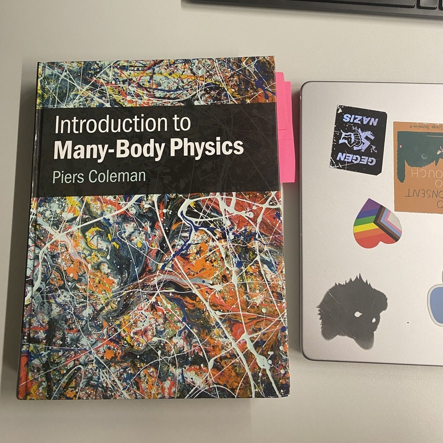
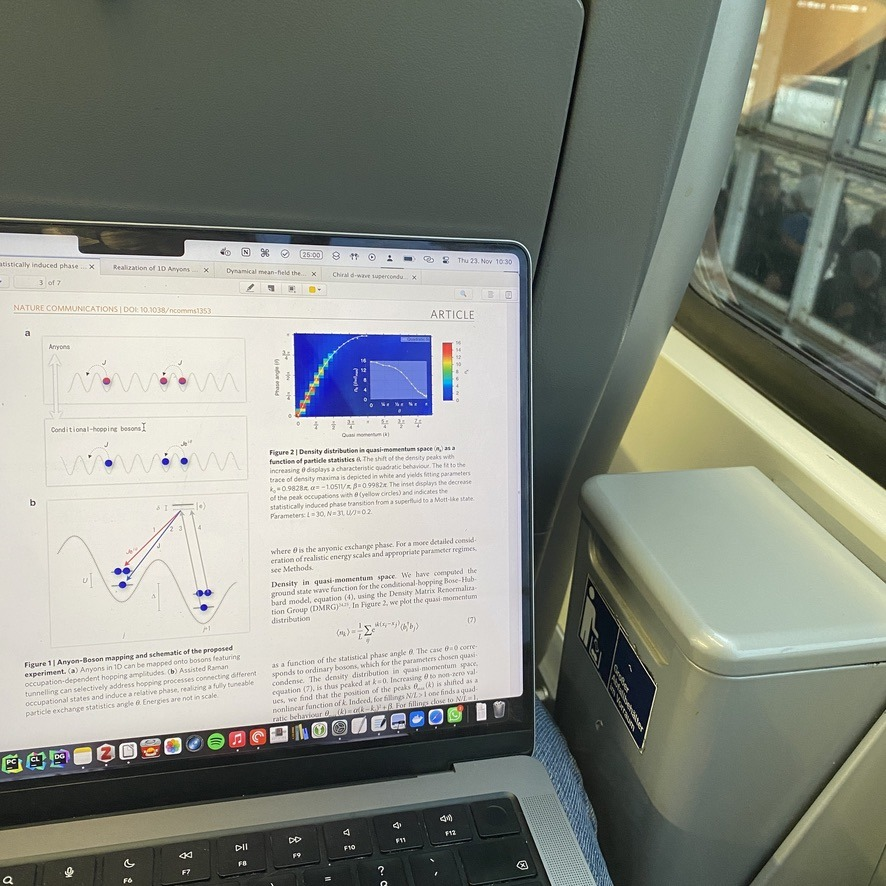

+++
title = "Week 6 // 20.11. - 24.11."
date = 2023-11-24
author = "Tjark Sievers"
categories = ["Blog"]
series = "Study Blog"
summary = ""
+++

This week I worked through more theory for the talks in the group seminars I'm attending. The one on Dec 6th is already coming very close, but I'm slowly getting a grip of Mott insulators.

Also I spent a lot of time working on a project for work. Its a website for distributing hardware to the research groups and I just got a lot into polishing the UI, using tailwindcss. Its a lot of fun, just seeing how I can make things look nice and uniform across the website.

