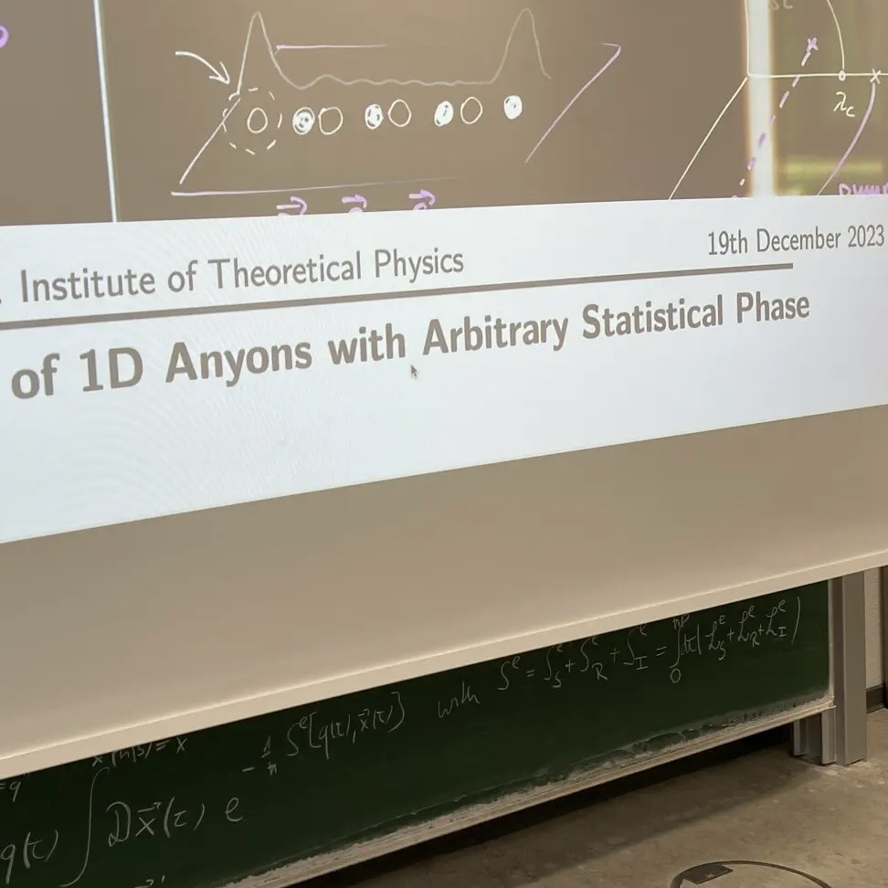

+++
title = "Week 10 // 18.12. - 22.12."
date = 2023-12-22
author = "Tjark Sievers"
categories = ["Blog"]
series = "Study Blog"
summary = ""
+++

I had the first of my group seminar talks on Tuesday! It went super well, I really got amazing feedback. The talk was about a super interesting paper from July, a group at Harvard managed to design an experiment that produced anyons (those are particles that are neither fermions and bosons) with a freely adjustable statistical angle. I mostly went into the theory behind it (a paper from 2011 which is amazingly simple) and then some experimental results. It was super amazing to talk in front of phd students and postdocs that work in the field and be able to explain them something!

