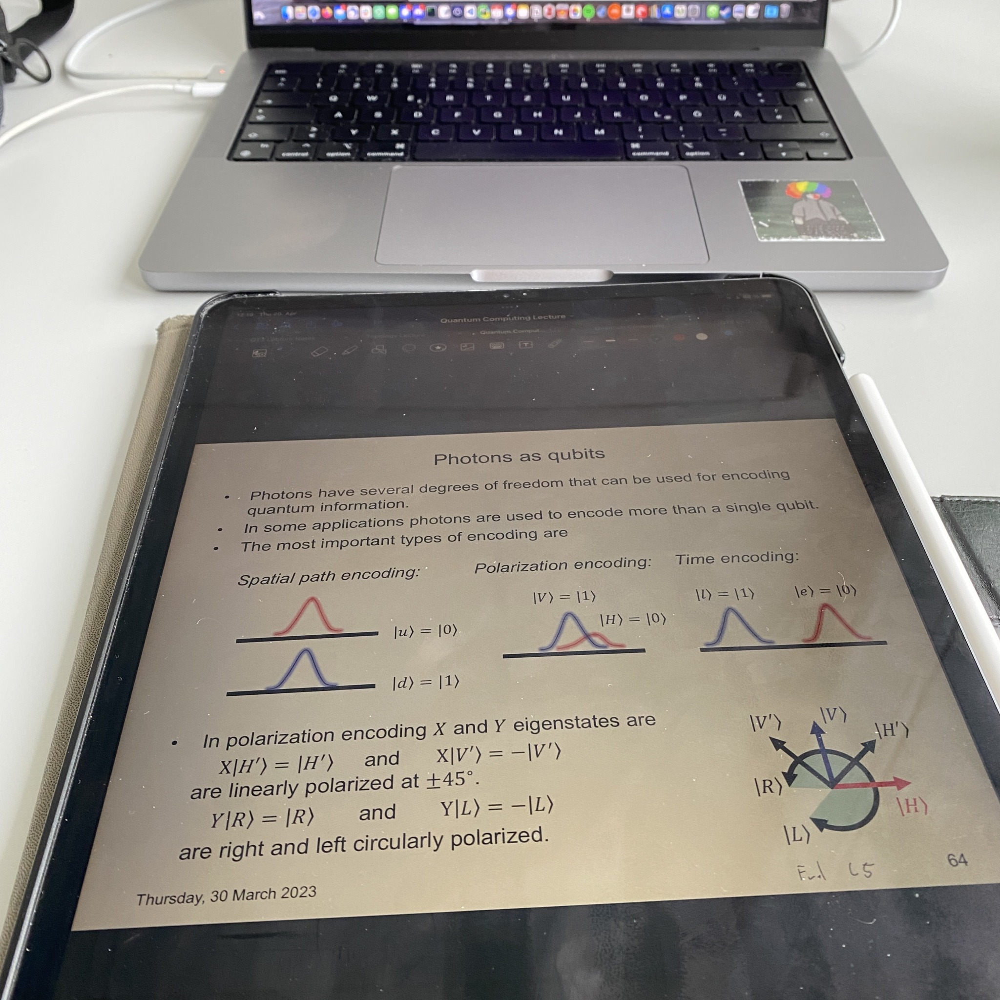

+++
title = "Week 3 // 17.04. - 21.04."
date = 2023-04-21
author = "Tjark Sievers"
categories = ["Blog"]
series = "Study Blog"
summary = ""
+++

This week was the first Uni week in a normal routine. And it's really a good routine, with a some more stressful days and also rest days in between.

Mondays I have two lectures (Quantum Computing and Quantum Technologies 2) and one exercise class, the first one starting 10, with loads of time in between to work on exercises. Tuesdays I actually have no lectures, so I use the time to sleep in a bit, sit in the library and work on exercise sheets. In the evening the Fridays for Future lecture is held, but I'm gonna mostly watch the recording of that. On Wednesday morning I have the Topology lecture and exercise, after that I'm working at my student job. The second lectures in Quantum Computing and Quantum Technologies 2 are then on Thursday, and Fridays are completely filled with my student job at the data centre.

