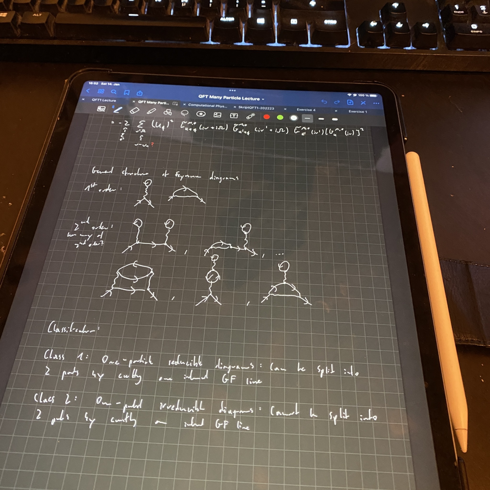

+++
title = "Week 13 // 09.01. - 13.01."
date = 2023-01-13
author = "Tjark Sievers"
categories = ["Blog"]
series = "Study Blog"
summary = ""
+++

The end of the semester is rapidly coming closer. I'm wrapping up the Computational Physics class with the last exercises and the final plots I need for the project presentation. The QFT in correlated many-particle systems course will be finished with an oral exam, I'm not really worried about that as I already went through most of the course work in another course last semester. So the only written exam will be Quantum Field Theory, which I will take near the end of march.

I really want to use the free time starting February to get my life back a bit, like visiting some of my friends again, going out a bit more, have some bars I want to visit more often.

