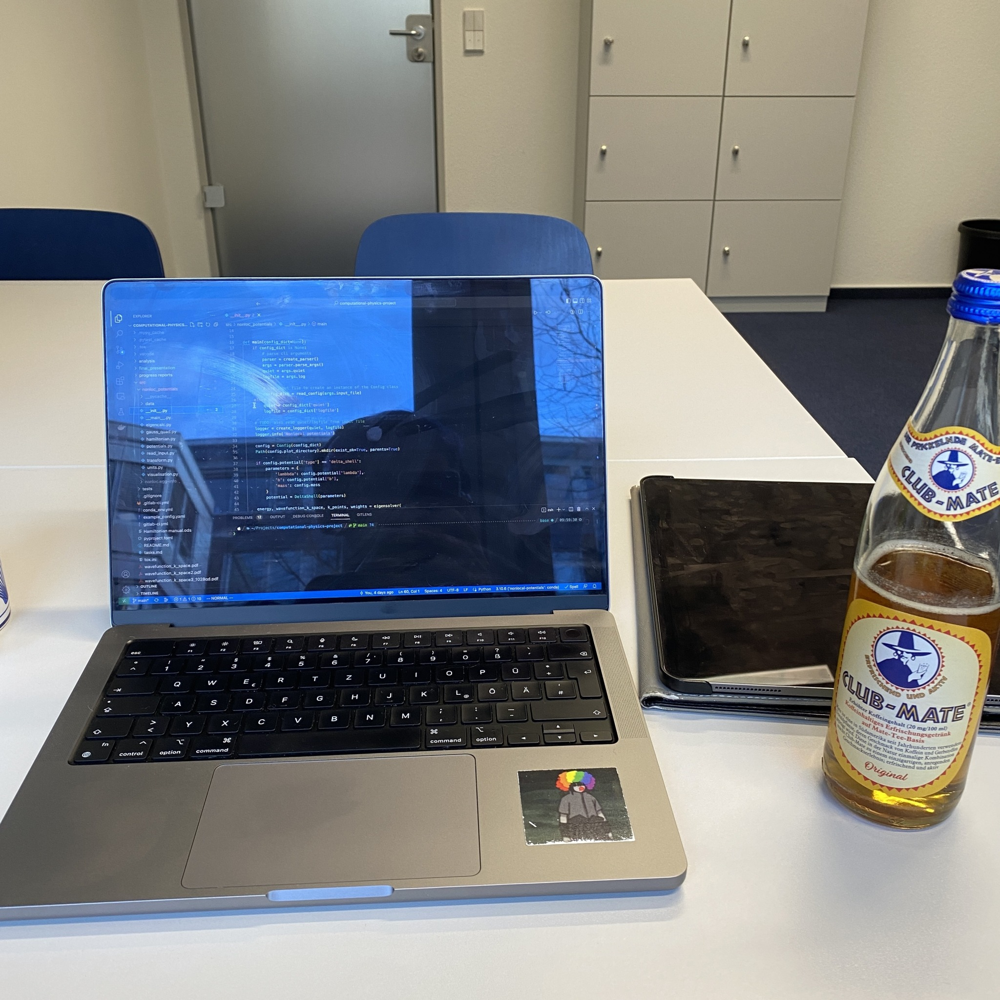
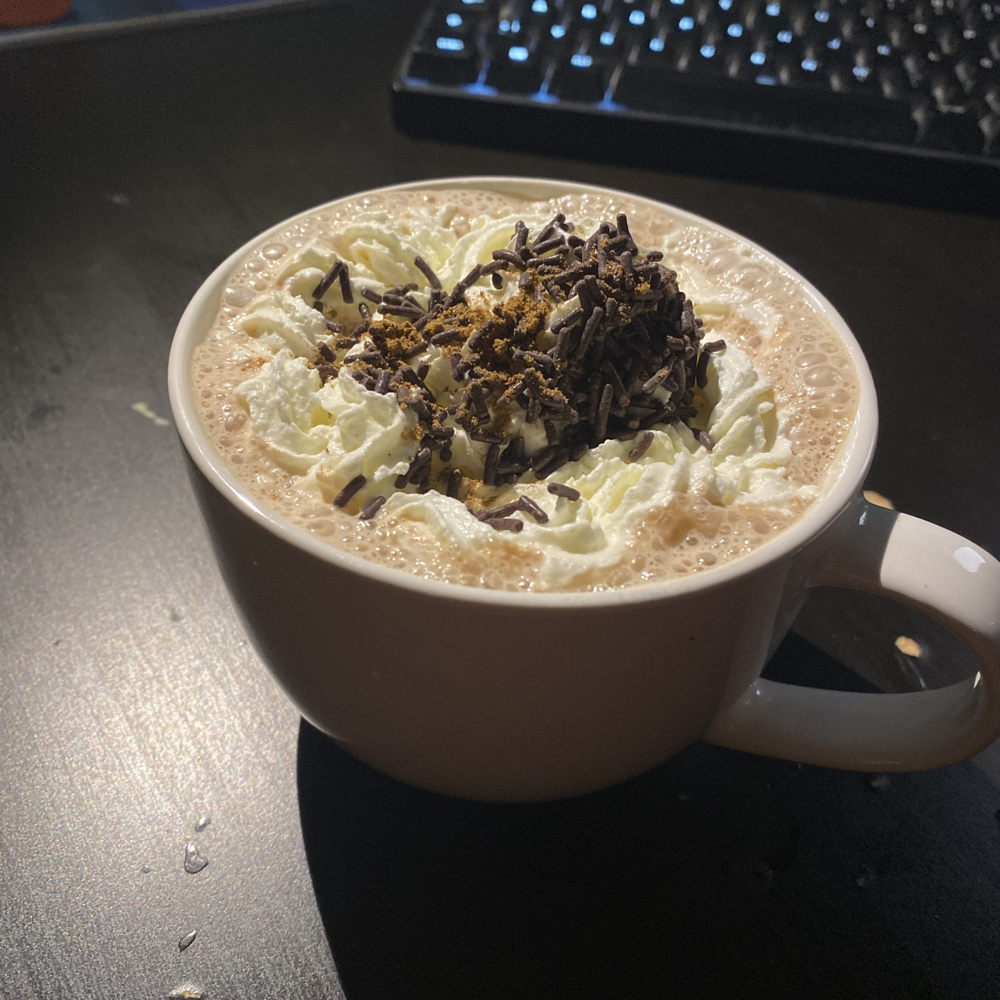

+++
title = "Week 14 // 16.01. - 20.01. //"
date = 2023-01-20
author = "Tjark Sievers"
categories = ["Blog"]
series = "Study Blog"
summary = ""
+++

The start of this week was very stressful, as I needed to finish a quite intense exercise sheet for the QFT in correlated many-particle systems until Thursday, which additionally got roadblocked because we finished most of the topics we needed on Wednesday, so there effectively was only one day to do all of that. I also ran the slides of the project presentation for the Computational Physics by our lecturer, and she was quite pleased with it already. So I am pretty much done with that part of the class, I only need to debug and submit 2 more exercises.

I took on Thursday way more relaxed then, just returned some books I had borrowed from our library and attended the one lecture of the day.

Today is a board game night organised by one of the groups at our institute, I'm already looking forward to digging deep into whatever super complex game we are playing. I'm probably going to get a date for my oral exam next week, so I can start preparing my study plan for both my exams.

