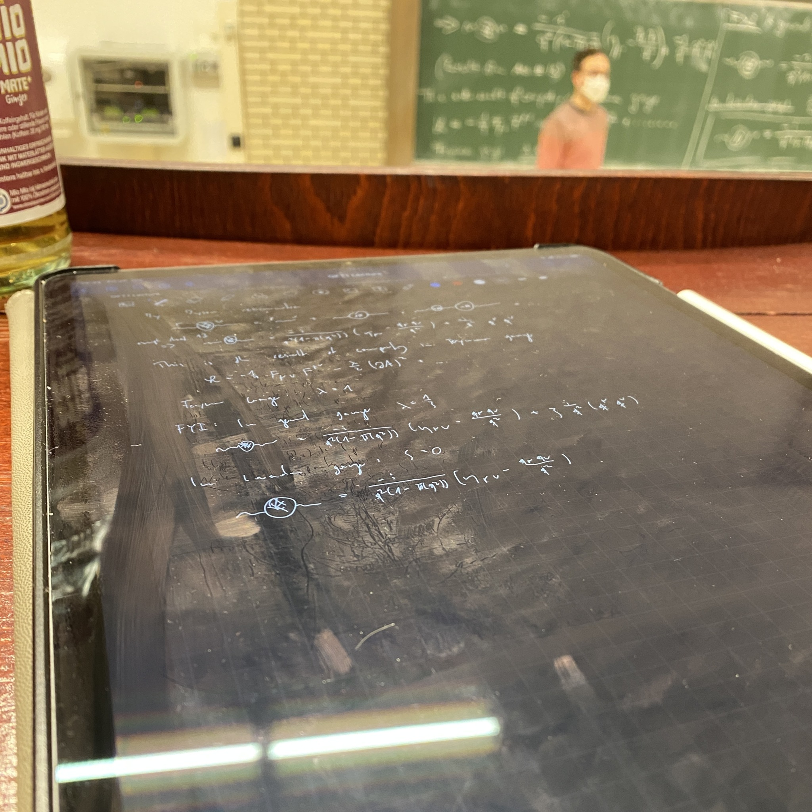
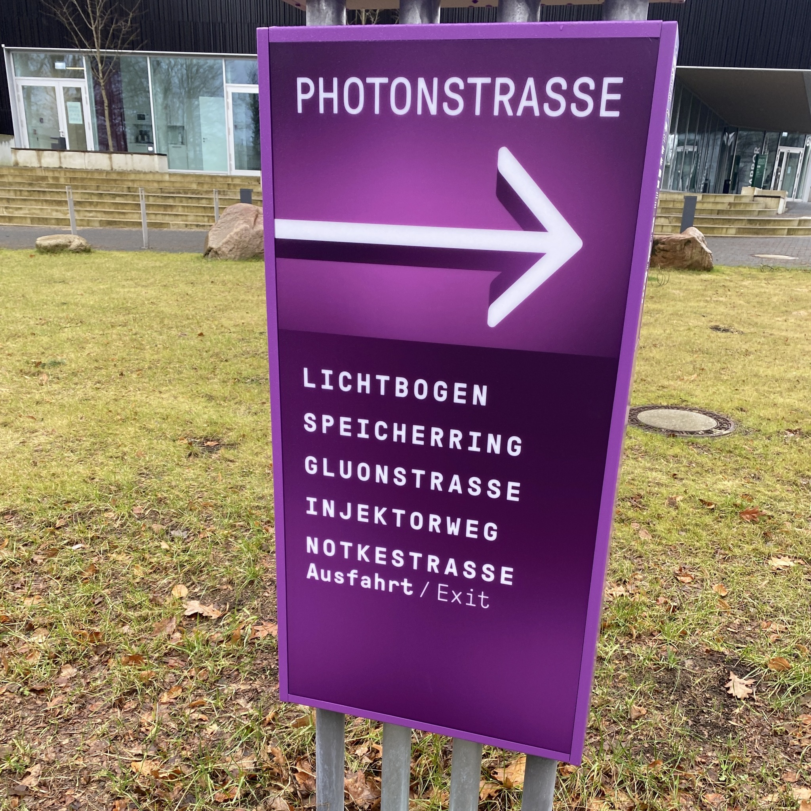

+++
title = "Week 15 // 23.01. - 27.01."
date = 2023-01-27
author = "Tjark Sievers"
categories = ["Blog"]
series = "Study Blog"
summary = ""
+++

This was now the second to last week of the semester, so all lectures are slowly coming to a close. Its quite satisfying to have many strings coming together in those final topics, thats what theoretical physics is all about for me, building up a system of tools and then seeing how they operate together to formulate and solve physical problems.

Next week the final project presentation for the Computational Physics class, which is a significant part of the final grade. I already finished my slides and ran it through once, so I feel pretty prepared for it.

