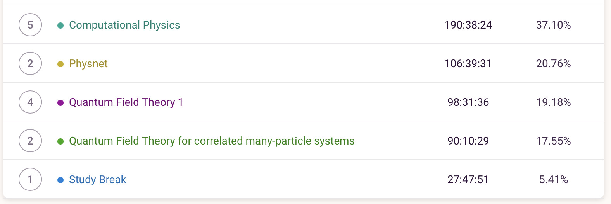

+++
title = "Week 16 // 30.01. - 03.02."
date = 2023-02-03
author = "Tjark Sievers"
categories = ["Blog"]
series = "Study Blog"
summary = ""
+++

During this semester I tracked all my time I spent either studying or working at my job at the our physics departments data centre (additionally there is a category for study breaks, which encompasses breaks in pomodoro cycles). The Computational physics lecture was by far the most time consuming, as I tried to solve the exercise every week and I needed to finish everything during the semester for the final grade. For the other lectures, some time will get added during the next weeks while I study for exams. I did not examine the raw data further, but I certainly could get some interesting results from that: when am I working the most? Do I need a break after lectures or can I go right into studying? I could surely use that to structure my day a bit better next semester, so thats definitely something I would like to do in the next weeks.

Right now I'm studying for the first oral exam. After that I can take a few weeks off before starting to study for the next exam.

After taking my last exam of the semester two weeks ago, I thought I could give a little update on my time tracking for the semester. This is all the additional time I spent on studying for the two exams. The biggest share went into working my job at the data centre, as I had gone into a bit of a debt in terms of hours worked there. The 14 hours for QFT in many-particle systems were quite enough, whereas for QFT 1, the 40 were in no way enough, as I missed way too much opportunity to work through exercises in the semester, so I'm not happy with how I did in the exam there.

All in all, I have then spent the following shares of time on my modules and work during the last semester:

I think that is quite impressive, and I'm interested to see how my next semester will compare to that!
