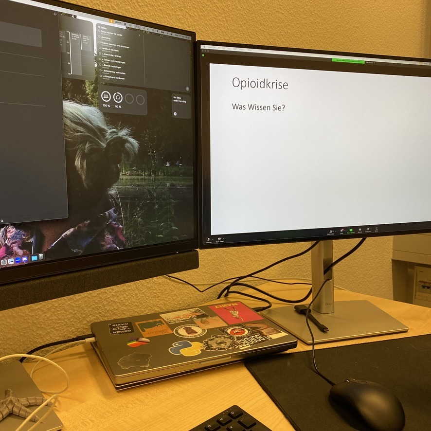
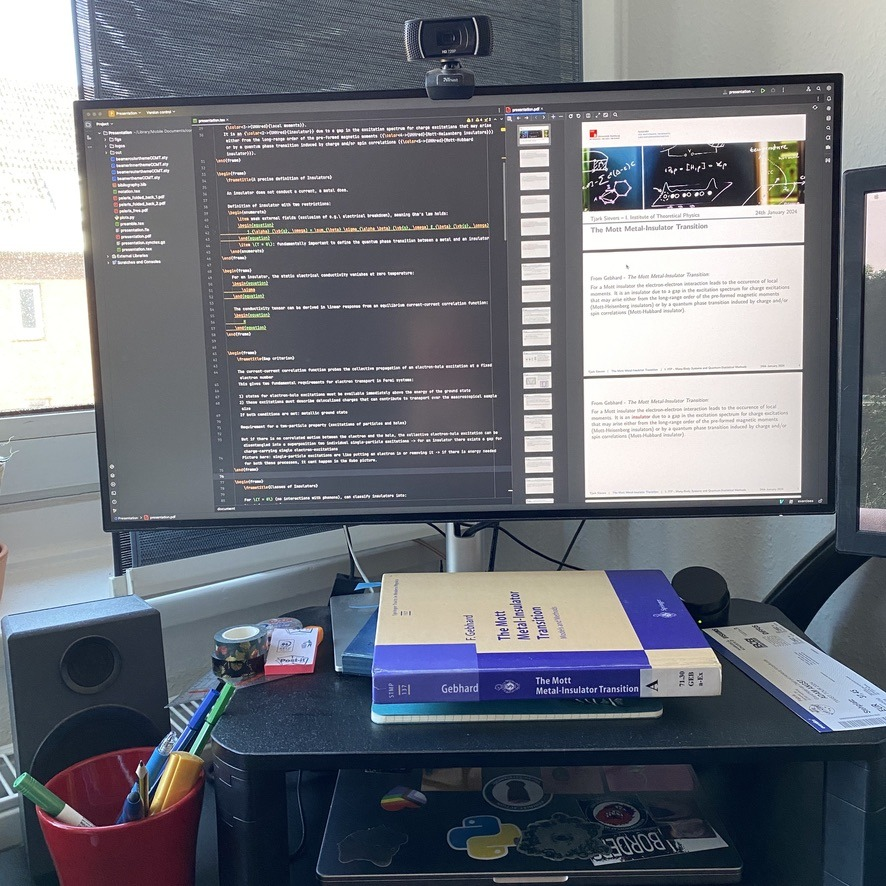

+++
title = "Week 14 // 15.01. - 19.01."
date = 2024-01-19
author = "Tjark Sievers"
categories = ["Blog"]
series = "Study Blog"
summary = ""
+++

I held the second of three presentations for this semester, and it went super well! The topic was superconductivity in a bit more advanced way, my supervisor and I chose the topic because it will fit very neatly into my master project I'm starting this summer. The next two weeks will be about finishing up my last presentation and all the things from my other modules and then enjoy two months of pretty much nothing going on! 

