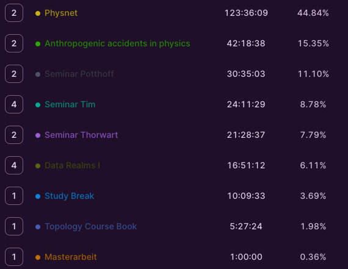

+++
title = "Week 17 // 29.01. - 09.02."
date = 2024-02-09
author = "Tjark Sievers"
categories = ["Blog"]
series = "Study Blog"
summary = ""
+++

Its time for a another review of my time spent last semester! I had semester with some quite small units, mostly preparing talks or things with just a single lecture peer week. The module "Anthropogenic accidents" had a super long lecture, so I can understand the most time going into it. And all in all, its just half of the time I used for full lectures in the last semesters.

All in all, I think I did well this semester being mindful of where I spend time, going after my interests and keeping quite a lot of time for free time.
