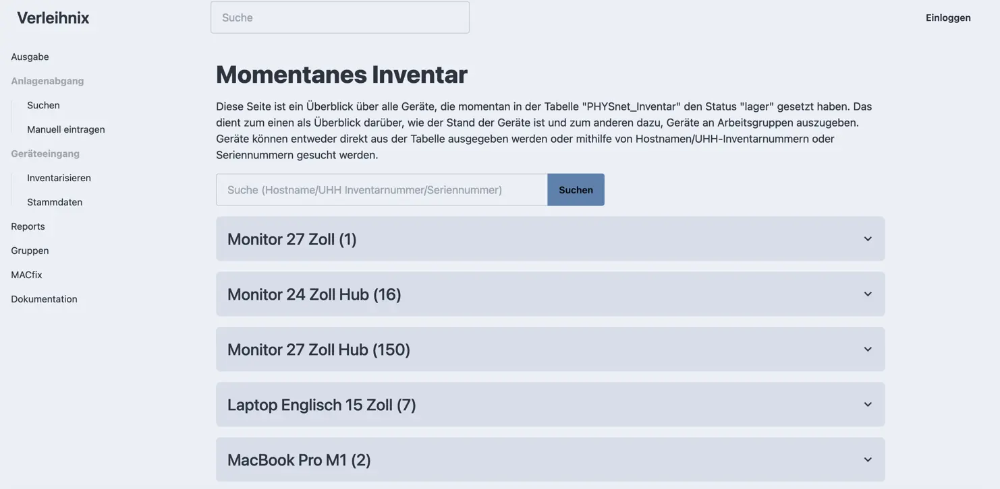
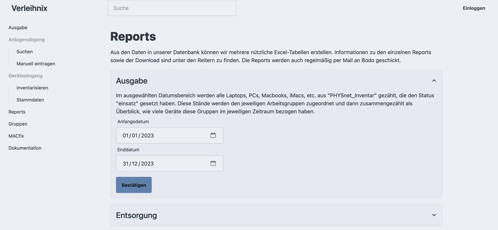
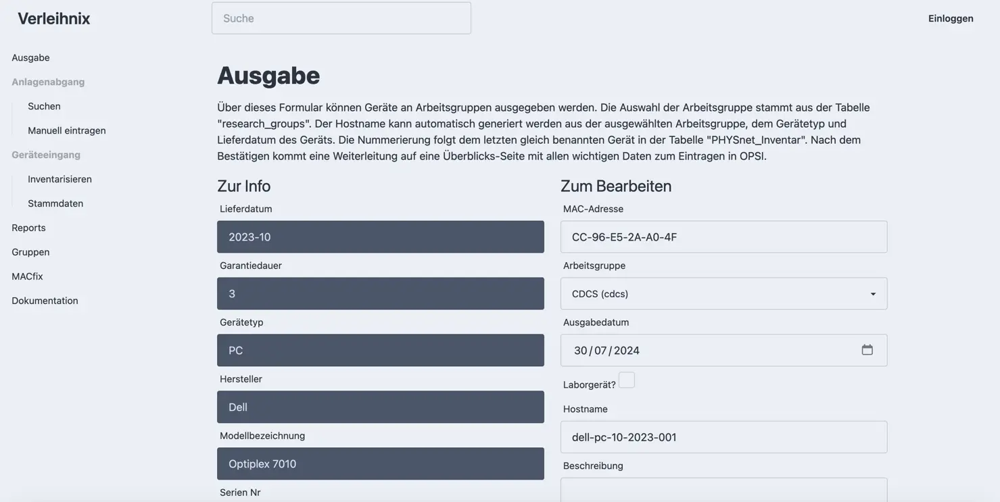

+++
title = "Verleihnix"
date = 2024-03-06
author = "Tjark Sievers"
categories = ["Project Showcases"]
tags = ["Python", "Django", "Docker", "TailwindCSS"]
image = "verleihnix_1.png"
+++

During my time working at the PHYSnet data centre, I developed a web application based on Flask to interface with a database containing data about devices we managed.
Some Tasks using this database were giving out PCs, Laptops and monitors to research groups, handling taking these devices back and filling out everything needed by the university management when the devices are coming in.

I managed to simplify many steps, for example automatically filling out the fields for hostnames with a specified naming scheme based on what hostnames are already given out or providing a simple interface to match inventory numbers given by the university management to the serial numbers of devices that were freshly delivered and then writing it into the database.

